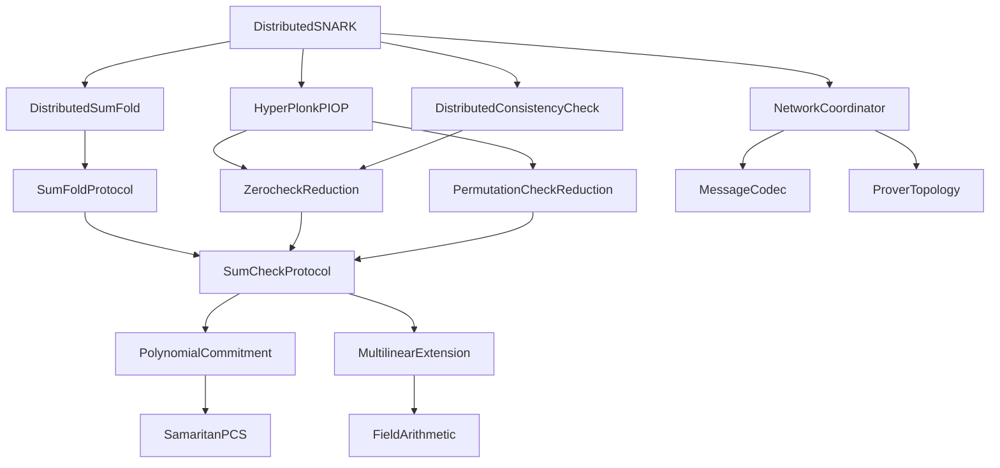
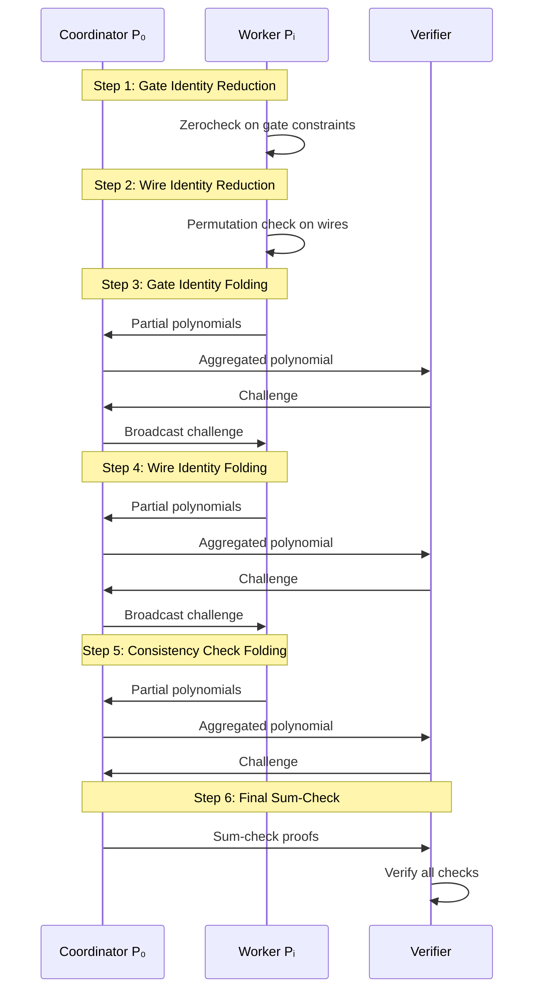

# Design Document: Distributed SNARK via Folding Schemes

## Overview

This document presents the comprehensive design for implementing a distributed Succinct Non-interactive Argument of Knowledge (SNARK) system based on folding schemes. The system distributes proof generation across multiple provers while maintaining optimal complexity bounds and achieving significant performance improvements over existing distributed SNARK constructions.

### Core Innovation

The design leverages a novel "distributed PIOP + additively homomorphic polynomial commitment" framework that enables:
- Linear prover complexity O(T) where T = N/M (N = total gates, M = number of workers)
- Logarithmic proof size O(log N) field elements + O(1) group elements
- Efficient verification with O(log N) field operations + O(M) multi-scalar multiplication
- 4.1-4.9× speedup over HyperPianist with 8 machines

### Design Principles

1. **Modularity**: Clear separation between cryptographic primitives, protocol layers, and distributed coordination
2. **Composability**: Use of Reduction of Knowledge (RoK) framework for modular protocol composition
3. **Efficiency**: Optimized algorithms for polynomial operations, field arithmetic, and network communication
4. **Correctness**: Formal mathematical specifications matching the research paper exactly
5. **Scalability**: Binary tree communication topology for logarithmic round complexity
6. **Maintainability**: Clean abstractions using Rust traits and the arkworks ecosystem

## Architecture

### High-Level System Architecture

The system is organized into four distinct layers, each with specific responsibilities and clear interfaces. This layered architecture ensures modularity, testability, and maintainability while enabling efficient distributed proof generation.

```
┌─────────────────────────────────────────────────────────────────┐
│                     Application Layer                            │
│  (Circuit Definition, Witness Generation, Proof Verification)   │
└────────────────────────┬────────────────────────────────────────┘
                         │
┌────────────────────────┴────────────────────────────────────────┐
│                   Protocol Layer                                 │
│  ┌──────────────┐  ┌──────────────┐  ┌──────────────┐         │
│  │ Distributed  │  │   SumFold    │  │  Sum-Check   │         │
│  │   SNARK      │  │   Protocol   │  │   Protocol   │         │
│  └──────────────┘  └──────────────┘  └──────────────┘         │
│  ┌──────────────┐  ┌──────────────┐  ┌──────────────┐         │
│  │  Zerocheck   │  │ Permutation  │  │ Consistency  │         │
│  │  Reduction   │  │    Check     │  │    Check     │         │
│  └──────────────┘  └──────────────┘  └──────────────┘         │
└────────────────────────┬────────────────────────────────────────┘
                         │
┌────────────────────────┴────────────────────────────────────────┐
│                 Cryptographic Primitives Layer                   │
│  ┌──────────────┐  ┌──────────────┐  ┌──────────────┐         │
│  │ Polynomial   │  │    Field     │  │   Elliptic   │         │
│  │ Commitment   │  │  Arithmetic  │  │    Curves    │         │
│  └──────────────┘  └──────────────┘  └──────────────┘         │
│  ┌──────────────┐  ┌──────────────┐  ┌──────────────┐         │
│  │  Multilinear │  │     FFT      │  │    Hash      │         │
│  │  Extension   │  │  Operations  │  │  Functions   │         │
│  └──────────────┘  └──────────────┘  └──────────────┘         │
└────────────────────────┬────────────────────────────────────────┘
                         │
┌────────────────────────┴────────────────────────────────────────┐
│              Distributed Communication Layer                     │
│  ┌──────────────┐  ┌──────────────┐  ┌──────────────┐         │
│  │   Network    │  │ Serialization│  │   Message    │         │
│  │   Protocol   │  │   / Codec    │  │   Routing    │         │
│  └──────────────┘  └──────────────┘  └──────────────┘         │
└─────────────────────────────────────────────────────────────────┘
```

#### Layer 1: Application Layer

**Purpose**: Provides high-level API for users to define circuits, generate witnesses, and verify proofs.

**Responsibilities**:
1. **Circuit Definition**: Users define computational circuits using a domain-specific language or builder pattern
   - Example: `circuit.add_gate(GateType::Mul, [wire_a, wire_b, wire_c])`
   - Translates high-level operations into HyperPlonk constraint system
   - Manages wire assignments and permutations

2. **Witness Generation**: Computes witness values from circuit inputs
   - Takes public inputs and private inputs
   - Executes circuit to compute all intermediate wire values
   - Validates that witness satisfies all constraints locally

3. **Proof Verification**: Verifies proofs without knowledge of witness
   - Takes public inputs and proof
   - Runs verifier algorithm
   - Returns accept/reject decision

**Key Abstractions**:
- `Circuit`: Represents computational circuit with gates and wires
- `Witness`: Contains all wire values for a circuit execution
- `PublicInputs`: Public values visible to verifier
- `Proof`: Serialized proof data

**Example Usage**:
```rust
// Define circuit
let mut circuit = Circuit::new();
circuit.add_mul_gate(a, b, c);  // c = a * b
circuit.add_add_gate(c, d, e);  // e = c + d

// Generate witness
let witness = circuit.generate_witness(&public_inputs, &private_inputs)?;

// Prove (distributed across M provers)
let proof = distributed_prove(&circuit, &witness, prover_id, num_provers).await?;

// Verify
let is_valid = verify(&circuit, &public_inputs, &proof)?;
```

#### Layer 2: Protocol Layer

**Purpose**: Implements cryptographic protocols for proof generation and verification.

**Key Components**:

**2.1 Distributed SNARK Orchestrator**
- **Role**: Coordinates the complete distributed proving process
- **Responsibilities**:
  - Manages protocol state machine (Init → Indexed → Ready → Proving → Complete)
  - Orchestrates execution of sub-protocols in correct order
  - Handles error recovery and protocol abortion
- **Interactions**:
  - Calls reduction protocols to transform constraints
  - Invokes distributed SumFold for instance aggregation
  - Coordinates with network layer for message passing

**2.2 Sum-Check Protocol**
- **Role**: Proves polynomial sum identities ∑_{x∈B^μ} h(w₀(x),...,w_{t-1}(x)) = v
- **Algorithm**: Interactive protocol with μ rounds
  - Round k: Prover sends univariate polynomial Q_k(X) of degree ≤ d
  - Verifier checks Q_{k-1}(r_{k-1}) = Q_k(0) + Q_k(1)
  - Verifier samples random challenge r_k ← F
- **Optimization**: Dynamic programming to compute Q_k in O(2^{μ-k+1} · d) time
- **Output**: Reduces to polynomial evaluation at random point r = (r₁,...,r_μ)

**2.3 SumFold Protocol (Single Prover)**
- **Role**: Folds M sum-check instances into single instance
- **Algorithm**:
  1. Verifier samples randomness ρ ← F^ν where M = 2^ν
  2. Prover computes interpolation polynomials f_j(b,x) = ∑_{i∈[M]} eq(b,⟨i⟩_ν) · w_{i,j}(x)
  3. Run sum-check on Q(b) = eq(ρ,b) · (∑_{x∈B^μ} h(f₀(b,x),...,f_{t-1}(b,x)))
  4. Compute folded witness w'_j = ∑_{i∈[M]} eq(r_b,⟨i⟩_ν) · w_{i,j}
- **Key Insight**: Linear combination of instances with eq weights preserves relation
- **Complexity**: O(M · 2^μ) prover time, O(log M) proof size

**2.4 Distributed SumFold Protocol**
- **Role**: Distributes SumFold computation across M provers
- **Communication Pattern**: Binary tree with log M rounds
  - Round k: 2^{ν-k} active provers, each sends to one other prover
  - Coordinator aggregates partial polynomials from all active provers
- **Key Innovation**: Each prover computes only local portion of interpolation
  - Prover P_i stores f_j(⟨i⟩_ν, x) = w_{i,j}(x) (local witness slice)
  - In round k, interpolates between two slices to get f_j({r₁,...,r_{k-1}}||b||⟨s⟩_{ν-k}, x)
- **Aggregation**: Coordinator sums partial polynomials Q_k^{(s)}(X) to get Q_k(X)
- **Complexity**: O(T) per prover where T = N/M, O(N) total communication

**2.5 Zerocheck Reduction**
- **Role**: Reduces R_ZERO (polynomial is zero on hypercube) to R_HSUM (sum-check)
- **Algorithm**:
  1. Verifier samples random point r ← F^μ
  2. Prover computes eq polynomial [[e_r]] where e_r(x) = eq(x,r)
  3. Transform: If f(x) = 0 for all x ∈ B^μ, then ∑_{x∈B^μ} f(x) · eq(x,r) = 0
- **Key Insight**: Multiplying by eq(x,r) converts zero-check to sum-check
- **Output**: Sum-check instance with claimed sum = 0

**2.6 Permutation Check Reduction**
- **Role**: Reduces R_PERM (g(x) = f(σ(x)) for permutation σ) to R_HSUM
- **Algorithm**:
  1. Verifier samples α, β ← F
  2. Compute identity polynomial f_id = s_id + α · w + β
  3. Compute permutation polynomial f_σ = s_σ + α · w + β
  4. Build accumulator v where v(0,x) = f_id(x)/f_σ(x) and v(1,x) = v(x,0) · v(x,1)
  5. Check v(1,...,1,0) = 1 (product of all ratios equals 1)
  6. Reduce to zerocheck on constraint polynomial ĝ
- **Key Insight**: Accumulator tracks running product; if permutation is valid, product = 1
- **Complexity**: O(2^μ) to compute accumulator

**2.7 Consistency Check Reduction**
- **Role**: Reduces R_CON (public inputs match witness) to R_HSUM
- **Algorithm**:
  1. Each prover computes difference w'_i = w_i(0^{μ-ν_p},·) − p_i
  2. Run zerocheck on each w'_i (should be zero if consistent)
  3. Use distributed SumFold to aggregate M zerocheck instances
- **Distributed Version**: Leverages distributed SumFold for efficiency
- **Complexity**: O(T) per prover, O(log M) proof size

**Protocol Composition**:
The protocols compose using the Reduction of Knowledge (RoK) framework:
- **Sequential Composition**: Π₂ ∘ Π₁ applies reductions in sequence
- **Parallel Composition**: Π₁ × Π₂ applies reductions independently
- **Preservation**: Composition preserves completeness, knowledge soundness, and public reducibility

#### Layer 3: Cryptographic Primitives Layer

**Purpose**: Provides low-level cryptographic operations used by protocols.

**3.1 Field Arithmetic Module**
- **Finite Field**: F_p where p = BN254 scalar field modulus
- **Operations**: Addition, subtraction, multiplication, division, inversion, exponentiation
- **Optimizations**:
  - Montgomery representation for efficient modular arithmetic
  - Batch inversion using Montgomery's trick: O(n) multiplications for n inversions
  - Precomputed constants for common operations
- **Implementation**: Uses `ark_ff::Field` trait from arkworks
- **Security**: Ensures |F| ≥ 2^128 for 128-bit security

**3.2 Elliptic Curve Operations Module**
- **Curve**: BN254 pairing-friendly curve
  - G1: Base group (256-bit points)
  - G2: Twist group (512-bit points)
  - GT: Target group (2048-bit elements)
- **Operations**:
  - Point addition: P + Q
  - Scalar multiplication: k · P using windowed double-and-add
  - Multi-scalar multiplication: ∑ᵢ kᵢPᵢ using Pippenger's algorithm
  - Pairing: e(P,Q) using optimal ate pairing
- **Optimizations**:
  - Precomputed tables for fixed-base scalar multiplication
  - Batch normalization for affine coordinates
  - Parallel MSM using multiple CPU cores
- **Implementation**: Uses `ark_ec` and `ark_bn254` from arkworks

**3.3 Polynomial Operations Module**
- **Representations**:
  - Coefficient form: [a₀, a₁, ..., aₐ] for univariate polynomials
  - Evaluation form: [f(0), f(1), ..., f(2^μ-1)] for multilinear polynomials
- **Operations**:
  - Evaluation: Horner's method for univariate, dynamic programming for multilinear
  - Addition: Coefficient-wise or evaluation-wise
  - Multiplication: FFT-based for univariate, tensor product for multilinear
- **FFT Implementation**:
  - Radix-2 Cooley-Tukey algorithm
  - In-place computation to save memory
  - Bit-reversal permutation for correct ordering
- **Implementation**: Uses `ark_poly` from arkworks

**3.4 Multilinear Extension Module**
- **MLE Definition**: Unique multilinear polynomial f̃ : F^μ → F extending f : B^μ → F
- **Formula**: f̃(X) = ∑_{x∈B^μ} f(x) · eq(x,X)
- **eq Function**: eq(x,X) = ∏^μ_{i=1}(x_iX_i + (1-x_i)(1-X_i))
- **Computation**:
  - Direct: O(2^μ · μ) time to compute f̃(X) for arbitrary X
  - Optimized: O(2^μ) time using dynamic programming
  - Precomputation: Build eq table in O(2^μ) time, then O(1) per query
- **Key Property**: f̃ is the unique multilinear polynomial agreeing with f on B^μ

**3.5 Polynomial Commitment Scheme (SamaritanPCS)**
- **Scheme**: Additively homomorphic multilinear polynomial commitment
- **Setup**: Generate structured reference string (SRS) for polynomials up to degree 2^μ
- **Commit**: com_f ← g^{f(s)} where s is secret evaluation point in SRS
- **Open**: Prove f(x) = z using pairing-based proof
- **Verify**: Check pairing equation e(com_f, g) = e(proof, h) · e(g, g)^z
- **Homomorphism**:
  - Additive: com_{f+g} = com_f · com_g
  - Scalar: com_{k·f} = com_f^k
- **Security**:
  - Binding: Based on discrete logarithm assumption
  - Hiding: Optional, requires additional randomness
- **Complexity**:
  - Commit: O(2^μ) group operations (linear in polynomial size)
  - Open: O(1) group elements in proof
  - Verify: O(μ) field operations + O(1) pairings

**3.6 Hash Functions Module**
- **Purpose**: Fiat-Shamir transformation to make protocols non-interactive
- **Hash Function**: SHA-256 or BLAKE2b modeled as random oracle
- **Domain Separation**: Different labels for different protocol phases
  - "sumcheck_challenge_round_k"
  - "sumfold_randomness"
  - "zerocheck_point"
- **Transcript Management**:
  - Append all prover messages to transcript
  - Hash transcript to generate verifier challenges
  - Ensures challenges are deterministic and verifiable

#### Layer 4: Distributed Communication Layer

**Purpose**: Manages network communication between distributed provers.

**4.1 Network Protocol Module**
- **Transport**: TCP for reliable, ordered delivery
- **Message Format**: [4-byte length][1-byte type][2-byte sequence][payload][4-byte checksum]
- **Message Types**:
  - CHALLENGE: Verifier challenge (field elements)
  - PARTIAL_POLY: Partial sum-check polynomial (coefficients)
  - COMMITMENT: Polynomial commitment (group element)
  - WITNESS_SHARE: Witness data (field elements)
  - FINAL_PROOF: Complete proof (serialized)
- **Flow Control**: Sliding window protocol to prevent buffer overflow
- **Error Detection**: CRC32 checksum for message integrity

**4.2 Serialization/Codec Module**
- **Field Element Encoding**: 32 bytes (256 bits) in little-endian
- **Group Element Encoding**: Compressed point (33 bytes for G1, 65 bytes for G2)
- **Polynomial Encoding**: Length prefix + coefficients
- **Proof Encoding**: Canonical order of all proof components
- **Deserialization Validation**:
  - Check field elements are in range [0, p)
  - Check group elements are on curve and in correct subgroup
  - Reject malformed messages immediately

**4.3 Message Routing Module**
- **Topology**: Binary tree for folding rounds, star for final aggregation
- **Routing Table**: Maps prover ID to network address
- **Round-Based Routing**:
  - Round k: P_s sends to P_{2^{ν-k}+s}
  - All active provers send to P₀ (coordinator)
  - P₀ broadcasts challenges to active provers
- **Barrier Synchronization**: All provers wait at round boundaries
- **Failure Handling**:
  - Timeout: 30 seconds per message
  - Retry: Up to 3 attempts with exponential backoff (1s, 2s, 4s)
  - Abort: If prover fails after retries, abort entire protocol

**Communication Complexity Analysis**:
- **Per Round**: Each active prover sends O(T) field elements
- **Total Rounds**: ν = log M folding rounds + μ = log T sum-check rounds
- **Total Communication**: O(N) field elements + O(M) group elements
- **Bandwidth**: ~10 MB/s per prover during active rounds
- **Latency**: O(log M) sequential communication steps

### Component Hierarchy



## Components and Interfaces

### 1. Core Cryptographic Primitives

#### 1.1 Field Arithmetic Module

**Purpose**: Provides finite field operations over F_p

**Interface**:
```rust
pub trait FieldOps<F: Field> {
    fn add(a: F, b: F) -> F;
    fn sub(a: F, b: F) -> F;
    fn mul(a: F, b: F) -> F;
    fn div(a: F, b: F) -> Result<F, Error>;
    fn inv(a: F) -> Result<F, Error>;
    fn pow(a: F, exp: &BigUint) -> F;
    fn batch_inv(elements: &[F]) -> Vec<F>;
}
```

**Implementation Details**:
- Uses `ark_ff` for field arithmetic
- Implements Montgomery's trick for batch inversion
- Supports BN254 scalar field F_r where r = 21888242871839275222246405745257275088548364400416034343698204186575808495617
- Ensures |F| ≥ 2^128 for 128-bit security

**Key Algorithms**:
- Field inversion using Fermat's little theorem: a^{-1} = a^{p-2} mod p
- Batch inversion: compute {a_i^{-1}} in O(n) multiplications using product tree
- Modular exponentiation using square-and-multiply

#### 1.2 Elliptic Curve Operations Module

**Purpose**: Provides group operations on BN254 curve

**Interface**:
```rust
pub trait GroupOps<G: Group> {
    fn add(p: G, q: G) -> G;
    fn double(p: G) -> G;
    fn scalar_mul(k: &BigUint, p: G) -> G;
    fn multi_scalar_mul(scalars: &[BigUint], points: &[G]) -> G;
    fn compress(p: G) -> CompressedPoint;
    fn decompress(cp: CompressedPoint) -> Result<G, Error>;
    fn pairing(p: G1, q: G2) -> GT;
}
```

**Implementation Details**:
- Uses `ark_ec` and `ark_bn254` for curve operations
- Implements Pippenger's algorithm for multi-scalar multiplication
- Point compression using x-coordinate and sign bit
- Optimal ate pairing for BN254

**Key Algorithms**:
- Scalar multiplication: windowed double-and-add method
- Multi-scalar multiplication: Pippenger's bucket method with window size w = 8
- Pairing computation: optimal ate pairing with Miller loop and final exponentiation

#### 1.3 Polynomial Operations Module

**Purpose**: Provides polynomial arithmetic and evaluation

**Interface**:
```rust
pub trait PolynomialOps<F: Field> {
    fn evaluate(&self, point: &[F]) -> F;
    fn add(&self, other: &Self) -> Self;
    fn mul(&self, other: &Self) -> Self;
    fn scalar_mul(&self, scalar: F) -> Self;
}

pub trait MultilinearPolynomial<F: Field>: PolynomialOps<F> {
    fn from_evaluations(evals: Vec<F>) -> Self;
    fn num_vars(&self) -> usize;
    fn evaluate_hypercube(&self) -> Vec<F>;
}
```

**Implementation Details**:
- Uses `ark_poly` for polynomial representations
- Stores multilinear polynomials as evaluation tables over Boolean hypercube
- Implements efficient evaluation using Horner's method
- FFT-based polynomial multiplication

**Key Algorithms**:
- Multilinear evaluation at r ∈ F^μ: O(2^μ) operations using dynamic programming
- Polynomial multiplication: O(d log d) using radix-2 FFT
- Multilinear extension: f̃(X) = ∑_{x∈B^μ} f(x) · eq(x,X)

#### 1.4 Multilinear Extension Module

**Purpose**: Computes multilinear extensions and eq function

**Interface**:
```rust
pub struct MultilinearExtension<F: Field> {
    evaluations: Vec<F>,
    num_vars: usize,
}

impl<F: Field> MultilinearExtension<F> {
    pub fn new(evaluations: Vec<F>) -> Self;
    pub fn evaluate(&self, point: &[F]) -> F;
    pub fn eq_function(x: &[bool], X: &[F]) -> F;
    pub fn eq_table(r: &[F]) -> Vec<F>;
}
```

**Implementation Details**:
- eq(x,X) = ∏^μ_{i=1}(x_iX_i + (1-x_i)(1-X_i))
- Precomputes eq values for reuse across evaluations
- Dynamic programming for efficient computation

**Key Algorithms**:
- eq table computation: O(2^μ) time using recursive doubling
- Multilinear evaluation: O(2^μ) time using Lagrange interpolation

#### 1.5 Polynomial Commitment Scheme (SamaritanPCS)

**Purpose**: Provides additively homomorphic polynomial commitments

**Interface**:
```rust
pub trait PolynomialCommitmentScheme<F: Field, G: Group> {
    type Commitment;
    type Proof;
    type PublicParameters;
    
    fn setup(max_degree: usize) -> Self::PublicParameters;
    fn commit(pp: &Self::PublicParameters, poly: &impl PolynomialOps<F>) 
        -> Self::Commitment;
    fn open(pp: &Self::PublicParameters, poly: &impl PolynomialOps<F>, 
            point: &[F]) -> (F, Self::Proof);
    fn verify(pp: &Self::PublicParameters, commitment: &Self::Commitment, 
              point: &[F], value: F, proof: &Self::Proof) -> bool;
    fn add_commitments(c1: &Self::Commitment, c2: &Self::Commitment) 
        -> Self::Commitment;
    fn scalar_mul_commitment(scalar: F, c: &Self::Commitment) 
        -> Self::Commitment;
}
```

**Implementation Details**:
- Implements SamaritanPCS with linear prover time O(2^μ)
- Constant-size proofs: O(1) group elements
- Logarithmic verification time: O(μ) field operations + O(1) pairings
- Additive homomorphism: [[a]] + [[b]] = com_a · com_b
- Scalar multiplication: k · [[a]] = com_a^k

**Security Properties**:
- Binding: No PPT adversary can find two different polynomials with same commitment
- Hiding: Commitment reveals no information about polynomial (optional)
- Knowledge soundness: Successful opening implies knowledge of polynomial

### 2. Sum-Check Protocol

**Purpose**: Proves ∑_{x∈B^μ} h(w₀(x),...,w_{t-1}(x)) = v

**Interface**:
```rust
pub struct SumCheckProtocol<F: Field> {
    num_vars: usize,
    degree: usize,
}

impl<F: Field> SumCheckProtocol<F> {
    pub fn prove<H>(
        &self,
        h: H,
        witnesses: &[MultilinearExtension<F>],
        transcript: &mut Transcript<F>
    ) -> SumCheckProof<F>
    where H: Fn(&[F]) -> F;
    
    pub fn verify(
        &self,
        claimed_sum: F,
        proof: &SumCheckProof<F>,
        transcript: &mut Transcript<F>
    ) -> Result<(Vec<F>, F), Error>;
}
```

**Protocol Flow**:
1. For each round k ∈ [μ]:
   - Prover computes univariate polynomial Q_k(X) of degree ≤ d
   - Prover sends Q_k to verifier
   - Verifier checks Q_{k-1}(r_{k-1}) = Q_k(0) + Q_k(1)
   - Verifier samples random challenge r_k ← F
2. Final check: Q_μ(r_μ) = h(w₀(r),...,w_{t-1}(r)) where r = (r₁,...,r_μ)

**Implementation Details**:
- Uses dynamic programming to compute Q_k efficiently in O(2^{μ-k+1} · d) time
- Reuses intermediate computations across rounds
- Total prover time: O(2^μ · d) field operations
- Knowledge error: dμ/|F|

**Key Optimization**: Algorithm 1 for evaluating product polynomials
```
Input: Linear univariate functions g₁(X),...,gₐ(X)
Output: h(X) = ∏ᵢ₌₁ᵈ gᵢ(X)

1. Initialize: t₁,ⱼ ← gⱼ for all j ∈ [d]
2. For i = 0 to log d:
   - For j = 0 to d/2ⁱ - 1:
     - tᵢ₊₁,ⱼ(X) ← tᵢ,₂ⱼ₋₁(X) · tᵢ,₂ⱼ(X) using FFT
3. Return h(X) = t_{log d,1}
```
Time complexity: O(d log d) using FFT

### 3. SumFold Protocol (Single Prover)

**Purpose**: Folds M sum-check instances into one

**Interface**:
```rust
pub struct SumFoldProtocol<F: Field> {
    num_instances: usize,
    num_vars: usize,
}

impl<F: Field> SumFoldProtocol<F> {
    pub fn fold<H>(
        &self,
        h: H,
        instances: Vec<SumCheckInstance<F>>,
        witnesses: Vec<Vec<MultilinearExtension<F>>>,
        transcript: &mut Transcript<F>
    ) -> (SumCheckInstance<F>, Vec<MultilinearExtension<F>>)
    where H: Fn(&[F]) -> F;
}
```

**Protocol Steps**:
1. Verifier samples ρ ← F^ν where M = 2^ν
2. Prover computes interpolation polynomials:
   - f_j(b,x) = ∑_{i∈[M]} eq(b,⟨i⟩_ν) · w_{i,j}(x)
3. Prover computes aggregated sum:
   - T₀ = ∑_{i∈[M]} eq(ρ,⟨i⟩_ν) · v_i
4. Run sum-check on Q(b) = eq(ρ,b) · (∑_{x∈B^μ} h(f₀(b,x),...,f_{t-1}(b,x)))
   - Proves ∑_{b∈B^ν} Q(b) = T₀
   - Reduces to Q(r_b) = c where r_b ∈ F^ν
5. Compute folded witness:
   - w'_j = ∑_{i∈[M]} eq(r_b,⟨i⟩_ν) · w_{i,j}
6. Compute folded value:
   - v' = c · eq(ρ,r_b)^{-1}
7. Output: ((v', [[w'₀]],...,[[w'_{t-1}]]); (w'₀,...,w'_{t-1}))

**Complexity**:
- Prover time: O(M · 2^μ) field operations
- Proof size: O(ν) = O(log M) field elements
- Verifier time: O(ν) field operations + O(M) group operations

### 4. Distributed SumFold Protocol

**Purpose**: Distributes SumFold computation across M provers

**Interface**:
```rust
pub struct DistributedSumFold<F: Field, N: Network> {
    prover_id: usize,
    num_provers: usize,
    network: N,
}

impl<F: Field, N: Network> DistributedSumFold<F, N> {
    pub async fn fold<H>(
        &mut self,
        h: H,
        local_instance: SumCheckInstance<F>,
        local_witnesses: Vec<MultilinearExtension<F>>,
        transcript: &mut Transcript<F>
    ) -> Result<(SumCheckInstance<F>, Vec<MultilinearExtension<F>>), Error>
    where H: Fn(&[F]) -> F;
}
```

**Protocol Architecture**:

```
Round k ∈ [ν]:
┌─────────┐                    ┌─────────┐
│  P_s    │ ──── message ────> │P_{2^{ν-k}+s}│
└─────────┘                    └─────────┘
     │                              │
     │ compute Q_k^{(s)}(X)        │ compute Q_k^{(s)}(X)
     │                              │
     └──────────> P₀ <─────────────┘
                  │
                  │ aggregate: Q_k(X) = ∑_s Q_k^{(s)}(X)
                  │
                  └──────> Verifier
```

**Protocol Steps**:
1. **Initialization** (all provers):
   - Store local instance (v_i, [[w_{i,0}]],...,[[w_{i,t-1}]])
   - Store local witnesses (w_{i,0},...,w_{i,t-1})
   - Receive randomness ρ ∈ F^ν from verifier
   - Compute eq(ρ,⟨i⟩_ν)

2. **Round k ∈ [ν]** (binary tree communication):
   - **Prover P_s** (s ∈ [2^{ν-k}]):
     - Send to P_{2^{ν-k}+s}:
       - eq(ρ,{r₁,...,r_{k-1}}||⟨s⟩_{ν-k+1})
       - f_j({r₁,...,r_{k-1}}||⟨s⟩_{ν-k+1},x) for all x ∈ B^μ, j ∈ [t]
   
   - **Prover P_{2^{ν-k}+s}**:
     - Receive data from P_s
     - Compute partial eq polynomial:
       - e_k^{(s)}(X) = (1-X) · eq(ρ,{r₁,...,r_{k-1}}||0||⟨s⟩_{ν-k}) 
                      + X · eq(ρ,{r₁,...,r_{k-1}}||1||⟨s⟩_{ν-k})
     - Compute witness interpolation:
       - f_{k,x}^{(s,j)}(X) = (1-X) · f_j({r₁,...,r_{k-1}}||0||⟨s⟩_{ν-k},x) 
                            + X · f_j({r₁,...,r_{k-1}}||1||⟨s⟩_{ν-k},x)
     - Compute partial sum-check polynomial:
       - Q_k^{(s)}(X) = e_k^{(s)}(X) · ∑_{x∈B^μ} h(f_{k,x}^{(s,0)}(X),...,f_{k,x}^{(s,t-1)}(X))
     - Send Q_k^{(s)}(X) to P₀

   - **Coordinator P₀**:
     - Aggregate: Q_k(X) = ∑_{s∈[2^{ν-k}]} Q_k^{(s)}(X)
     - Send Q_k(X) to verifier
     - Receive challenge r_k from verifier
     - Broadcast r_k to all active provers

   - **All active provers**:
     - Update state with r_k
     - Compute next-round data

3. **Final Round** (after ν rounds):
   - P₀ obtains eq(ρ,r_b) and f_j(r_b,x) where r_b = {r₁,...,r_ν}
   - Compute c = Q(r_b)

4. **Witness Folding** (all provers):
   - Each P_i computes:
     - e_i = eq(r_b,⟨i⟩_ν)
     - ([[w'_{i,j}]], w'_{i,j}) = (e_i · [[w_{i,j}]], e_i · w_{i,j}) for j ∈ [t]
   - Send [[w'_{i,j}]] to P₀

5. **Witness Aggregation** (binary tree):
   - For i ∈ [M-1]:
     - P_i updates: w'_j ← w'_j + w'_{M-i-1,j}
     - P_i sends w'_j to P_{M-i-2}
   - P₀ obtains final folded witness

6. **Output**:
   - P₀ computes:
     - v' = c · eq(ρ,r_b)^{-1}
     - [[w'_j]] = ∑_{i∈[M]} [[w'_{i,j}]]
   - Output: ((v', [[w'₀]],...,[[w'_{t-1}]]); (w'₀,...,w'_{t-1}))

**Complexity Analysis**:
- Prover P_i (i ≠ 0): O(T) field ops + O(T) group ops where T = N/M
- Coordinator P₀: O(T) field ops + O(T) group ops + O(M) group ops
- Communication: O(N) field elements total
- Proof size: O(log M) field elements
- Verifier: O(log M) field ops + O(M) MSM

### 5. HyperPlonk Constraint System

**Purpose**: Represents circuits with custom gates

**Interface**:
```rust
pub struct HyperPlonkConstraintSystem<F: Field> {
    pub num_constraints: usize,      // n = 2^μ
    pub num_public_inputs: usize,    // ℓ = 2^{ν_p}
    pub num_witness_per_gate: usize, // ℓ_w = 2^{ν_w}
    pub num_selector_per_gate: usize,// ℓ_q = 2^{ν_q}
    pub gate_function: Box<dyn Fn(&[F]) -> F>,
    pub permutation: Permutation,
}

pub struct HyperPlonkInstance<F: Field, G: Group> {
    pub public_inputs: MultilinearExtension<F>,
    pub witness_commitment: Commitment<G>,
}

pub struct HyperPlonkWitness<F: Field> {
    pub witness: MultilinearExtension<F>,
}
```

**Constraint Types**:
1. **Gate Identity**: f̃(X) = 0 for all X ∈ B^μ
   - f̃(X) := f(q(⟨0⟩_{ν_q},X),...,q(⟨ℓ_q-1⟩_{ν_q},X), 
                w(⟨0⟩_{ν_w},X),...,w(⟨ℓ_w-1⟩_{ν_w},X))
   
2. **Wire Identity**: w(σ(x)) = w(x) for all x ∈ B^{μ+ν_w}
   - Ensures wire connections are consistent via permutation σ
   
3. **Consistency Check**: p(X) = w(0^{μ+ν_w-ν_p},X) for all X ∈ B^{ν_p}
   - Ensures public inputs match witness values

**Implementation Details**:
- Selector polynomials q encode gate types
- Witness polynomial w encodes wire values
- Permutation σ defines circuit topology
- Supports vanilla Plonk gates with degree d ≤ 3

### 6. Zerocheck Reduction

**Purpose**: Reduces R_ZERO to R_HSUM

**Interface**:
```rust
pub struct ZerocheckReduction<F: Field> {
    num_vars: usize,
    degree: usize,
}

impl<F: Field> ZerocheckReduction<F> {
    pub fn reduce(
        &self,
        poly_commitment: Commitment<G>,
        poly: MultilinearExtension<F>,
        transcript: &mut Transcript<F>
    ) -> (SumCheckInstance<F>, MultilinearExtension<F>);
}
```

**Protocol Steps**:
1. Verifier samples random vector r ← F^μ
2. Prover computes [[e_r]] where e_r = eq(·,r)
3. Output instance: x = (0, [[f]], [[e_r]])
4. Output witness: w = f
5. Updated structure: h'({w̃_j}_{j∈[t]}, g) = h({w̃_j}_{j∈[t]}) · g

**Correctness**: 
- If f(x) = 0 for all x ∈ B^μ, then ∑_{x∈B^μ} f(x) · eq(x,r) = 0

### 7. Permutation Check Reduction

**Purpose**: Reduces R_PERM to R_HSUM

**Interface**:
```rust
pub struct PermutationCheckReduction<F: Field> {
    permutation: Permutation,
    num_vars: usize,
}

impl<F: Field> PermutationCheckReduction<F> {
    pub fn reduce(
        &self,
        f_commitment: Commitment<G>,
        g_commitment: Commitment<G>,
        f: MultilinearExtension<F>,
        g: MultilinearExtension<F>,
        transcript: &mut Transcript<F>
    ) -> (SumCheckInstance<F>, Vec<MultilinearExtension<F>>);
}
```

**Protocol Steps**:
1. Verifier samples α, β ← F
2. Compute identity polynomial: f_id = s_id + α · w + β
3. Compute permutation polynomial: f_σ = s_σ + α · w + β
4. Compute accumulator polynomial v ∈ F^{(≤1)}_{μ+1}:
   - v(0,x) = f_id(x)/f_σ(x)
   - v(1,x) = v(x,0) · v(x,1) for all x ∈ B^μ
5. Verify v(1,...,1,0) = 1
6. Compute constraint polynomial ĝ ∈ F^{(≤2)}_{μ+1}:
   - ĝ(x₀,x) = (1-x₀) · (v(1,x) - v(x,0) · v(x,1)) 
              + x₀ · (f_σ(x) · v(0,x) - f_id(x))
7. Reduce to zerocheck on ĝ

**Key Insight**: 
- Accumulator v tracks running product of ratios
- Constraint ĝ ensures accumulator is computed correctly
- Final check v(1,...,1,0) = 1 ensures permutation is valid

### 8. Consistency Check Reduction (Distributed)

**Purpose**: Reduces distributed R_CON to R_HSUM

**Interface**:
```rust
pub struct DistributedConsistencyCheck<F: Field, N: Network> {
    prover_id: usize,
    num_provers: usize,
    network: N,
}

impl<F: Field, N: Network> DistributedConsistencyCheck<F, N> {
    pub async fn reduce(
        &mut self,
        public_input: MultilinearExtension<F>,
        witness_commitment: Commitment<G>,
        witness: MultilinearExtension<F>,
        transcript: &mut Transcript<F>
    ) -> Result<(SumCheckInstance<F>, MultilinearExtension<F>), Error>;
}
```

**Protocol Steps**:
1. Each P_i computes difference polynomial:
   - [[w'_i]] = [[w_i(0^{μ-ν_p},·)]] − [[p_i]]
2. Each P_i runs zerocheck reduction on w'_i
3. Run distributed SumFold to fold M zerocheck instances

**Complexity**:
- Each P_i: O(T) field ops + O(T) group ops
- Communication: O(N) field elements
- Proof size: O(log M) field elements

### 9. Complete Distributed SNARK Protocol

**Purpose**: Integrates all components into complete distributed argument

**Interface**:
```rust
pub struct DistributedSNARK<F: Field, G: Group, N: Network> {
    prover_id: usize,
    num_provers: usize,
    constraint_system: HyperPlonkConstraintSystem<F>,
    pcs: SamaritanPCS<F, G>,
    network: N,
}

impl<F: Field, G: Group, N: Network> DistributedSNARK<F, G, N> {
    pub async fn prove(
        &mut self,
        local_instance: HyperPlonkInstance<F, G>,
        local_witness: HyperPlonkWitness<F>
    ) -> Result<Proof<F, G>, Error>;
    
    pub fn verify(
        pp: &PublicParameters,
        instances: &[HyperPlonkInstance<F, G>],
        proof: &Proof<F, G>
    ) -> bool;
}
```

**Protocol Flow**:



**Detailed Protocol Steps**:

**Step 1: Gate Identity Reduction** (each prover independently)
- Input: ({[[w_{i,j}]]}_{j∈[ℓ_w]}; {w_{i,j}}_{j∈[ℓ_w]}) ∈ R_ZERO
- Run Protocol D.1 (Zerocheck)
- Output: ((0, {[[w_{i,j}]]}_{j∈[ℓ_w]}, [[e_i]]); {w_{i,j}}_{j∈[ℓ_w]})
- Updated structure: f'

**Step 2: Wire Identity Reduction** (each prover independently)
- Input: (([[w_i]], [[w_i]]); w_i) ∈ R_PERM
- Run Protocol D.2 (Permutation Check)
- Output: ((0, [[ĝ_{i,1}]], [[ĝ_{i,2}]], [[ĝ_{i,3}]], [[ê_i]]); ĝ_{i,1}, ĝ_{i,2}, ĝ_{i,3})
- Updated structure: h'

**Step 3: Gate Identity Folding** (distributed)
- Input: M instances from Step 1
- Run Protocol 3.2 (Distributed SumFold) with structure f'
- Output: ((0, {[[w̃_j]]}_{j∈[ℓ_w]}, [[ẽ]]); {w̃_j}_{j∈[ℓ_w]})

**Step 4: Wire Identity Folding** (distributed)
- Input: M instances from Step 2
- Run Protocol 3.2 (Distributed SumFold) with structure h'
- Output: ((0, [[ĝ₁]], [[ĝ₂]], [[ĝ₃]], [[ê]]); ĝ₁, ĝ₂, ĝ₃)

**Step 5: Consistency Check Folding** (distributed)
- Input: ((p_i, [[w_i]]); w_i) for each prover
- Run Protocol 4.2 (Distributed Consistency Check)
- Output: ((0, [[w']], [[e']]); w')
- Updated structure: h'_c

**Step 6: Final Sum-Check** (coordinator only)
- P₀ runs sum-check on three folded instances:
  1. (f'; (0, {[[w̃_j]]}_{j∈[ℓ_w]}, [[ẽ]]); {w̃_j}_{j∈[ℓ_w]}) ∈ R_HSUM
  2. (h'; (0, [[ĝ₁]], [[ĝ₂]], [[ĝ₃]], [[ê]]); ĝ₁, ĝ₂, ĝ₃) ∈ R_HSUM
  3. (h'_c; (0, [[w']], [[e']]); w') ∈ R_HSUM
- Verifier checks all sum-check proofs
- Verifier performs polynomial commitment openings

**Proof Structure**:
```rust
pub struct Proof<F: Field, G: Group> {
    // Folding transcripts
    gate_folding_transcript: Vec<F>,
    wire_folding_transcript: Vec<F>,
    consistency_folding_transcript: Vec<F>,
    
    // Final sum-check proofs
    gate_sumcheck_proof: SumCheckProof<F>,
    wire_sumcheck_proof: SumCheckProof<F>,
    consistency_sumcheck_proof: SumCheckProof<F>,
    
    // Polynomial commitment openings
    opening_proofs: Vec<OpeningProof<G>>,
}
```

**Complexity Summary**:
- Prover P_i (i ≠ 0): O(T)F + O(T)G
- Coordinator P₀: O(T)F + O(T)G + O(M)G
- Communication: O(N)|F| + O(M)|G|
- Proof size: O(log N)|F| + O(1)|G|
- Verifier: O(log N)F + O(M)G + O(1)P

### 10. Network Communication Layer

**Purpose**: Manages distributed communication between provers

**Interface**:
```rust
pub trait Network: Send + Sync {
    async fn send(&mut self, to: usize, message: Message) -> Result<(), Error>;
    async fn receive(&mut self, from: usize) -> Result<Message, Error>;
    async fn broadcast(&mut self, message: Message) -> Result<(), Error>;
    async fn barrier(&mut self) -> Result<(), Error>;
}

pub enum Message {
    Challenge(Vec<F>),
    PartialPolynomial(UnivariatePolynomial<F>),
    Commitment(Commitment<G>),
    WitnessShare(Vec<F>),
    FinalProof(Proof<F, G>),
}
```

**Network Topology**:
```
Binary Tree for Round k:

Level 0:  P₀  P₁  P₂  P₃  P₄  P₅  P₆  P₇
          │   │   │   │   │   │   │   │
Round 1:  └───┴───┘   └───┴───┘   └───┴───┘
              │           │           │
Round 2:      └───────────┴───────────┘
                          │
Round 3:                  P₀ (Coordinator)
```

**Communication Patterns**:
1. **Point-to-Point**: P_s → P_{2^{ν-k}+s} in round k
2. **Aggregation**: All active provers → P₀
3. **Broadcast**: P₀ → All active provers
4. **Barrier Synchronization**: All provers wait at round boundaries

**Message Format**:
```
[4-byte length][1-byte type][sequence number][payload][checksum]
```

**Error Handling**:
- Timeout: 30 seconds per message
- Retry: Up to 3 attempts with exponential backoff
- Connection failure: Abort protocol with error

**Implementation Details**:
- Uses TCP for reliable delivery
- Length-prefixed encoding for framing
- Sequence numbers for ordering
- Checksums for integrity

## Data Models

### Core Data Structures

#### Field Element
```rust
pub struct FieldElement<F: Field>(F);
```
- Represents element in finite field F_p
- Supports arithmetic operations: +, -, *, /, ^{-1}
- Serialization: ⌈log₂|F|⌉ bits

#### Group Element
```rust
pub struct GroupElement<G: Group>(G);
```
- Represents point on elliptic curve
- Supports group operations: +, scalar multiplication
- Serialization: Compressed point encoding (x-coordinate + sign bit)

#### Multilinear Polynomial
```rust
pub struct MultilinearPolynomial<F: Field> {
    evaluations: Vec<F>,  // 2^μ evaluations over Boolean hypercube
    num_vars: usize,      // μ
}
```
- Stored as evaluation table over B^μ
- Evaluation at arbitrary point: O(2^μ) time
- Memory: O(2^μ) field elements

#### Univariate Polynomial
```rust
pub struct UnivariatePolynomial<F: Field> {
    coefficients: Vec<F>,  // Coefficients [a₀, a₁, ..., aₐ]
    degree: usize,         // d
}
```
- Stored in coefficient form
- Evaluation: O(d) time using Horner's method
- FFT multiplication: O(d log d) time

#### Commitment
```rust
pub struct Commitment<G: Group> {
    point: G,
}
```
- Represents polynomial commitment
- Supports homomorphic operations
- Serialization: Compressed group element

#### Sum-Check Instance
```rust
pub struct SumCheckInstance<F: Field, G: Group> {
    pub claimed_sum: F,
    pub witness_commitments: Vec<Commitment<G>>,
}
```

#### Sum-Check Proof
```rust
pub struct SumCheckProof<F: Field> {
    pub round_polynomials: Vec<UnivariatePolynomial<F>>,
}
```
- Contains μ univariate polynomials, one per round
- Size: O(μ · d) field elements

#### Transcript
```rust
pub struct Transcript<F: Field> {
    messages: Vec<Vec<u8>>,
    hash_function: Box<dyn Fn(&[u8]) -> F>,
}
```
- Maintains protocol transcript for Fiat-Shamir
- Generates challenges via hash function
- Domain separation for different protocol phases

#### Permutation
```rust
pub struct Permutation {
    mapping: Vec<usize>,  // σ: [0, 2^μ) → [0, 2^μ)
}
```
- Represents wire permutation in HyperPlonk
- Stored as array mapping
- Verification: O(2^μ) time

### Relation Definitions

#### R_HSUM (High-Degree Sum-Check)
```rust
pub struct RelationHSUM<F: Field> {
    pub structure: Box<dyn Fn(&[F]) -> F>,  // h
    pub num_vars: usize,                     // μ
    pub degree: usize,                       // d
}
```
Accepts: (h; (v, [[w₀]],...,[[w_{t-1}]]); (w₀,...,w_{t-1}))
Where: ∑_{x∈B^μ} h(w₀(x),...,w_{t-1}(x)) = v

#### R_ZERO (Zerocheck)
```rust
pub struct RelationZERO<F: Field> {
    pub num_vars: usize,  // μ
    pub degree: usize,    // d
}
```
Accepts: ([[f]]; f)
Where: f(x) = 0 for all x ∈ B^μ

#### R_PERM (Permutation Check)
```rust
pub struct RelationPERM<F: Field> {
    pub permutation: Permutation,  // σ
    pub num_vars: usize,           // μ
}
```
Accepts: (σ; ([[f]], [[g]]); (f, g))
Where: g(x) = f(σ(x)) for all x ∈ B^μ

#### R_CON (Consistency Check)
```rust
pub struct RelationCON<F: Field> {
    pub num_public_vars: usize,  // ν_p
    pub num_witness_vars: usize, // μ
}
```
Accepts: ((p, [[w]]); w)
Where: p(X) = w(0^{μ-ν_p},X) for all X ∈ B^{ν_p}

## Error Handling

### Error Types

```rust
pub enum Error {
    // Field arithmetic errors
    DivisionByZero,
    FieldElementOutOfRange,
    
    // Polynomial errors
    InvalidDegree,
    InvalidNumVars,
    EvaluationPointMismatch,
    
    // Commitment errors
    CommitmentVerificationFailed,
    InvalidOpening,
    
    // Protocol errors
    SumCheckVerificationFailed,
    InvalidChallenge,
    TranscriptError,
    
    // Network errors
    ConnectionFailed,
    MessageTimeout,
    InvalidMessage,
    SerializationError,
    
    // Configuration errors
    InvalidParameters,
    UnsupportedCircuitSize,
    InvalidProverCount,
    
    // System errors
    MemoryAllocationFailed,
    InsufficientFieldSize,
}
```

### Error Handling Strategy

1. **Validation at Boundaries**:
   - Validate all inputs at public API boundaries
   - Check parameter constraints (field size, circuit size, prover count)
   - Reject invalid configurations early with descriptive errors

2. **Graceful Degradation**:
   - Network timeouts: Retry up to 3 times with exponential backoff
   - Connection failures: Attempt reconnection before aborting
   - Memory pressure: Use streaming evaluation when possible

3. **Fail-Fast for Cryptographic Errors**:
   - Commitment verification failure: Immediately reject proof
   - Sum-check verification failure: Immediately reject proof
   - Invalid field operations: Return error without partial state

4. **Logging and Diagnostics**:
   - Log all errors with context (prover ID, round number, operation)
   - Include stack traces for debugging
   - Provide actionable error messages

5. **Recovery Mechanisms**:
   - Checkpoint protocol state at round boundaries
   - Support protocol restart from last checkpoint (future extension)
   - Clean up resources on error (connections, memory allocations)

### Validation Rules

**Parameter Validation**:
- Field size: |F| ≥ 2^λ where λ is security parameter
- Circuit size: N must be power of 2
- Prover count: M must be power of 2
- Degree bound: d ≤ max_degree configured in PCS

**Runtime Validation**:
- Polynomial degree: Verify degree ≤ claimed degree
- Commitment consistency: Verify commitments match witnesses
- Challenge validity: Verify challenges are in field F
- Message ordering: Verify sequence numbers are correct

## Testing Strategy

### Unit Tests

**Cryptographic Primitives**:
- Field arithmetic: Test all operations including edge cases (0, 1, -1)
- Group operations: Test point addition, doubling, scalar multiplication
- Polynomial operations: Test evaluation, addition, multiplication
- Multilinear extension: Test eq function, MLE computation
- Commitment scheme: Test commit, open, verify, homomorphic operations

**Protocol Components**:
- Sum-check: Test with various degrees and number of variables
- SumFold: Test with different numbers of instances
- Zerocheck: Test with zero and non-zero polynomials
- Permutation check: Test with identity and non-identity permutations
- Consistency check: Test with matching and mismatching public inputs

### Integration Tests

**Single Prover**:
- Complete protocol with M=1 (baseline)
- Various circuit sizes: 2^10, 2^12, 2^14, 2^16
- Different gate types: addition, multiplication, custom gates

**Distributed Provers**:
- M ∈ {2, 4, 8} provers
- Circuit sizes: 2^18, 2^19, 2^20, 2^21, 2^22
- Network simulation with latency and packet loss

**Correctness Tests**:
- Valid proofs are accepted
- Invalid proofs are rejected
- Soundness: Modified witnesses are detected
- Completeness: All valid proofs pass

### Property-Based Tests

**Algebraic Properties**:
- Homomorphic commitment: [[a]] + [[b]] = [[a+b]]
- Scalar multiplication: k · [[a]] = [[k·a]]
- Multilinear extension uniqueness
- Permutation composition: σ₁ ∘ σ₂

**Protocol Properties**:
- Folding correctness: Folded instance is valid
- Sum-check soundness: Invalid sums are rejected
- Transcript consistency: Challenges are deterministic

### Performance Benchmarks

**Metrics to Measure**:
1. Prover time (per prover)
2. Coordinator overhead
3. Communication volume
4. Proof size
5. Verification time
6. Memory usage

**Benchmark Configurations**:
- Circuit sizes: 2^18, 2^19, 2^20, 2^21, 2^22
- Prover counts: 1, 2, 4, 8
- Hardware: Document CPU, RAM, network specs

**Comparison Baselines**:
- HyperPianist (distributed SNARK)
- Cirrus (distributed SNARK)
- Single-prover HyperPlonk

**Target Performance** (8 machines, 2^20 gates):
- Prover time: 4.1-4.9× speedup over HyperPianist
- Proof size: 8.5-9.9 KB
- Verification time: 4.05-5.08 ms

### Stress Tests

**Scalability**:
- Maximum circuit size: 2^25 gates
- Maximum prover count: 32 provers
- Long-running protocols: 1000+ rounds

**Fault Tolerance**:
- Network failures: Timeout, packet loss, disconnection
- Prover failures: Crash, hang, Byzantine behavior
- Resource exhaustion: Memory limits, CPU throttling

### Security Tests

**Soundness Tests**:
- Invalid witness: Modify witness values
- Invalid permutation: Break wire connections
- Invalid public inputs: Mismatch with witness
- Malicious prover: Send incorrect messages

**Knowledge Extraction**:
- Verify extractor can recover witness
- Measure extraction probability
- Test with various adversarial strategies

## Implementation Phases

### Phase 1: Core Cryptographic Primitives (Foundation)

**Deliverables**:
- Field arithmetic module with BN254 support
- Elliptic curve operations with pairing
- Polynomial operations (univariate and multilinear)
- Multilinear extension and eq function
- Basic polynomial commitment (placeholder, then SamaritanPCS)

**Dependencies**: arkworks libraries (ark_ff, ark_ec, ark_poly, ark_bn254)

**Testing**: Unit tests for all operations

**Estimated Complexity**: ~2000 lines of code

### Phase 2: Sum-Check Protocol (Single Prover)

**Deliverables**:
- Sum-check prover implementation
- Sum-check verifier implementation
- Transcript management for Fiat-Shamir
- Algorithm 1 for product polynomial evaluation
- Optimization: Dynamic programming for round computation

**Dependencies**: Phase 1

**Testing**: Unit tests + integration tests with various degrees and variables

**Estimated Complexity**: ~1500 lines of code

### Phase 3: SumFold Protocol (Single Prover)

**Deliverables**:
- SumFold prover implementation
- SumFold verifier implementation
- Interpolation polynomial computation
- Witness folding logic

**Dependencies**: Phase 2

**Testing**: Integration tests with M ∈ {2, 4, 8} instances

**Estimated Complexity**: ~1000 lines of code

### Phase 4: HyperPlonk Constraint System

**Deliverables**:
- Constraint system representation
- Gate identity checking
- Wire identity checking (permutation)
- Consistency checking
- Circuit builder utilities

**Dependencies**: Phase 1

**Testing**: Unit tests with simple circuits (addition, multiplication)

**Estimated Complexity**: ~1500 lines of code

### Phase 5: Reduction Protocols

**Deliverables**:
- Zerocheck reduction (R_ZERO → R_HSUM)
- Permutation check reduction (R_PERM → R_HSUM)
- Consistency check reduction (R_CON → R_HSUM)
- Accumulator polynomial computation

**Dependencies**: Phase 2, Phase 4

**Testing**: Integration tests for each reduction

**Estimated Complexity**: ~2000 lines of code

### Phase 6: Network Communication Layer

**Deliverables**:
- Network trait and TCP implementation
- Message serialization/deserialization
- Binary tree topology management
- Error handling and retry logic
- Barrier synchronization

**Dependencies**: None (can be developed in parallel)

**Testing**: Network simulation tests with latency and failures

**Estimated Complexity**: ~1500 lines of code

### Phase 7: Distributed SumFold

**Deliverables**:
- Distributed SumFold prover implementation
- Round-by-round communication protocol
- Partial polynomial computation
- Witness aggregation logic
- Coordinator aggregation

**Dependencies**: Phase 3, Phase 6

**Testing**: Integration tests with M ∈ {2, 4, 8} provers

**Estimated Complexity**: ~2000 lines of code

### Phase 8: Distributed Consistency Check

**Deliverables**:
- Distributed consistency check implementation
- Integration with distributed SumFold

**Dependencies**: Phase 5, Phase 7

**Testing**: Integration tests with distributed provers

**Estimated Complexity**: ~500 lines of code

### Phase 9: Complete Distributed SNARK

**Deliverables**:
- Integration of all components
- Complete prover implementation
- Complete verifier implementation
- Proof serialization
- End-to-end protocol execution

**Dependencies**: All previous phases

**Testing**: Full integration tests with various configurations

**Estimated Complexity**: ~1500 lines of code

### Phase 10: Optimization and Benchmarking

**Deliverables**:
- Performance profiling
- Optimization of hot paths
- Parallel computation within provers
- Memory optimization
- Comprehensive benchmarks
- Comparison with HyperPianist and Cirrus

**Dependencies**: Phase 9

**Testing**: Performance regression tests

**Estimated Complexity**: ~1000 lines of code + benchmarking infrastructure

**Total Estimated Code**: ~15,000 lines of Rust code

## Security Considerations

### Cryptographic Assumptions

1. **Discrete Logarithm Problem**: Security of elliptic curve operations
2. **Pairing Assumptions**: Security of BN254 pairing
3. **Random Oracle Model**: Security of Fiat-Shamir transformation
4. **Schwartz-Zippel Lemma**: Soundness of polynomial identity testing

### Security Properties

**Perfect Completeness**:
- Honest prover with valid witness always convinces verifier
- Probability of acceptance: 1

**Knowledge Soundness**:
- Successful prover must know valid witness
- Knowledge error: δ ≤ negl(λ)
- Extractor exists that recovers witness in expected polynomial time

**Succinctness**:
- Proof size: O(log N)|F| + O(1)|G| = poly(λ, log|C|)
- Verification time: O(log N)F + O(M)G + O(1)P = poly(λ, log|C|)

**Public Coin**:
- All verifier messages are uniformly random
- Enables Fiat-Shamir transformation

### Threat Model

**Honest-but-Curious Provers**:
- Provers follow protocol but may try to learn information
- Current design does not provide zero-knowledge
- Future extension: Add zero-knowledge property

**Malicious Prover**:
- Single malicious prover cannot forge valid proof
- Verifier detects invalid proofs with probability 1 - negl(λ)

**Malicious Verifier**:
- Cannot learn anything beyond validity of statement
- (Only relevant if zero-knowledge is added)

**Network Adversary**:
- Can observe, delay, or drop messages
- Cannot forge or modify messages (authenticated channels assumed)
- Protocol aborts on timeout or connection failure

### Security Parameters

**λ = 128 bits**:
- Field size: |F| ≥ 2^128
- Curve order: ≥ 2^256
- Hash output: ≥ 256 bits
- Knowledge error: ≤ 2^{-128}

**Concrete Security**:
- Sum-check error: dμ/|F| ≤ 2^{-128}
- Folding error: dν/|F| ≤ 2^{-128}
- Commitment binding: ≤ 2^{-128}
- Total error: ≤ 3 · 2^{-128} (union bound)

## Performance Optimization Techniques

### 1. Dynamic Programming for Sum-Check

**Optimization**: Reuse intermediate computations across rounds

**Implementation**:
```rust
// Maintain table of partial sums
let mut table = vec![F::zero(); 2^(μ-k+1)];
for x in Boolean hypercube of size μ-k+1 {
    table[x] = h(w₀(r₁,...,r_{k-1},x), ..., w_{t-1}(r₁,...,r_{k-1},x));
}
// Compute Q_k(X) from table in O(2^{μ-k+1}) time
```

**Benefit**: Reduces prover time from O(2^μ · μ · d) to O(2^μ · d)

### 2. FFT for Polynomial Multiplication

**Optimization**: Use radix-2 FFT for multiplying degree-d polynomials

**Implementation**:
```rust
fn multiply_polynomials(p: &[F], q: &[F]) -> Vec<F> {
    let n = (p.len() + q.len()).next_power_of_two();
    let p_fft = fft(p, n);
    let q_fft = fft(q, n);
    let result_fft = pointwise_mul(p_fft, q_fft);
    ifft(result_fft, n)
}
```

**Benefit**: Reduces multiplication time from O(d²) to O(d log d)

### 3. Batch Inversion (Montgomery's Trick)

**Optimization**: Compute multiple field inversions efficiently

**Implementation**:
```rust
fn batch_inverse(elements: &[F]) -> Vec<F> {
    let n = elements.len();
    let mut products = vec![F::one(); n];
    
    // Forward pass: compute products
    for i in 1..n {
        products[i] = products[i-1] * elements[i-1];
    }
    
    // Compute inverse of final product
    let mut inv = (products[n-1] * elements[n-1]).inverse();
    
    // Backward pass: compute individual inverses
    let mut result = vec![F::zero(); n];
    for i in (0..n).rev() {
        result[i] = products[i] * inv;
        inv = inv * elements[i];
    }
    
    result
}
```

**Benefit**: Reduces n inversions from O(n · I) to O(n · M + I) where I = inversion cost, M = multiplication cost

### 4. Precomputation of eq Values

**Optimization**: Precompute and cache eq(ρ, ·) values

**Implementation**:
```rust
struct EqTable<F: Field> {
    values: Vec<F>,
    point: Vec<F>,
}

impl<F: Field> EqTable<F> {
    fn new(point: &[F]) -> Self {
        let n = 1 << point.len();
        let mut values = vec![F::one(); n];
        
        for (i, &r) in point.iter().enumerate() {
            let step = 1 << i;
            for j in 0..n {
                if (j >> i) & 1 == 1 {
                    values[j] *= r;
                } else {
                    values[j] *= F::one() - r;
                }
            }
        }
        
        Self { values, point: point.to_vec() }
    }
    
    fn get(&self, x: &[bool]) -> F {
        let index = x.iter().enumerate()
            .fold(0, |acc, (i, &b)| acc | ((b as usize) << i));
        self.values[index]
    }
}
```

**Benefit**: Reduces repeated eq computations from O(μ) to O(1) per query

### 5. Pippenger's Algorithm for Multi-Scalar Multiplication

**Optimization**: Efficient computation of ∑ᵢ kᵢPᵢ

**Implementation**:
```rust
fn multi_scalar_mul<G: Group>(scalars: &[BigUint], points: &[G]) -> G {
    let window_size = 8;  // Optimal for typical sizes
    let num_windows = (256 + window_size - 1) / window_size;
    
    let mut buckets = vec![G::zero(); 1 << window_size];
    let mut result = G::zero();
    
    for window in (0..num_windows).rev() {
        // Double result window_size times
        for _ in 0..window_size {
            result = result.double();
        }
        
        // Clear buckets
        buckets.fill(G::zero());
        
        // Accumulate points into buckets
        for (scalar, point) in scalars.iter().zip(points.iter()) {
            let bucket_index = extract_window(scalar, window, window_size);
            if bucket_index > 0 {
                buckets[bucket_index] += point;
            }
        }
        
        // Sum buckets with running sum
        let mut running_sum = G::zero();
        for bucket in buckets.iter().rev() {
            running_sum += bucket;
            result += running_sum;
        }
    }
    
    result
}
```

**Benefit**: Reduces MSM time from O(M · log p) to O(M / log M · log p)

### 6. Parallel Computation Within Prover

**Optimization**: Use multi-core parallelism for independent computations

**Implementation**:
```rust
use rayon::prelude::*;

// Parallel polynomial evaluation
let evaluations: Vec<F> = (0..2^μ)
    .into_par_iter()
    .map(|i| {
        let x = index_to_boolean_vector(i, μ);
        polynomial.evaluate(&x)
    })
    .collect();

// Parallel sum-check round computation
let partial_sums: Vec<F> = (0..num_chunks)
    .into_par_iter()
    .map(|chunk_id| {
        compute_partial_sum(chunk_id, witnesses, h)
    })
    .collect();
```

**Benefit**: Near-linear speedup with number of cores (e.g., 8× on 8-core machine)

### 7. Memory Streaming

**Optimization**: Avoid storing entire polynomials when possible

**Implementation**:
```rust
// Stream polynomial evaluations instead of storing
fn stream_evaluate<F, H>(
    h: H,
    witnesses: &[impl Fn(&[bool]) -> F],
    callback: impl Fn(F)
) where H: Fn(&[F]) -> F {
    for x in BooleanHypercube::new(μ) {
        let values: Vec<F> = witnesses.iter()
            .map(|w| w(&x))
            .collect();
        let result = h(&values);
        callback(result);
    }
}
```

**Benefit**: Reduces memory usage from O(2^μ) to O(1) for streaming operations

## Deployment Considerations

### Hardware Requirements

**Minimum per Prover**:
- CPU: 4 cores, 2.5 GHz
- RAM: 8 GB
- Network: 100 Mbps
- Storage: 10 GB

**Recommended per Prover**:
- CPU: 8+ cores, 3.0+ GHz
- RAM: 16+ GB
- Network: 1 Gbps
- Storage: 50 GB SSD

**Coordinator (P₀) Additional Requirements**:
- RAM: +4 GB for aggregation
- Network: Higher bandwidth for receiving from all provers

### Network Configuration

**Topology**: Star topology with coordinator as hub
- All provers connect to coordinator
- Coordinator manages message routing

**Latency Requirements**:
- LAN: < 1 ms (optimal)
- WAN: < 50 ms (acceptable)
- > 100 ms: Performance degradation

**Bandwidth Requirements**:
- Per prover: ~10 MB/s during folding rounds
- Coordinator: ~10 MB/s × M during aggregation

### Configuration Parameters

```rust
pub struct SystemConfig {
    // Cryptographic parameters
    pub security_parameter: usize,        // λ = 128
    pub field_modulus: BigUint,           // BN254 scalar field
    
    // Circuit parameters
    pub circuit_size: usize,              // N = 2^μ
    pub num_provers: usize,               // M = 2^ν
    pub max_degree: usize,                // d ≤ 3 for vanilla Plonk
    
    // Network parameters
    pub coordinator_address: String,      // IP:port
    pub prover_addresses: Vec<String>,    // IP:port for each prover
    pub timeout_ms: u64,                  // 30000
    pub max_retries: usize,               // 3
    
    // Performance parameters
    pub num_threads: usize,               // Number of CPU cores to use
    pub enable_parallel: bool,            // Enable rayon parallelism
    pub enable_streaming: bool,           // Enable memory streaming
    
    // Logging parameters
    pub log_level: LogLevel,              // INFO
    pub log_file: Option<String>,         // Optional log file path
}
```

### Monitoring and Observability

**Metrics to Track**:
- Prover time per round
- Communication volume per round
- Memory usage per prover
- Network latency between provers
- Error rates and retry counts

**Logging**:
- Protocol phase transitions
- Round completion times
- Message send/receive events
- Error occurrences with context

**Alerting**:
- Prover failure detection
- Network partition detection
- Performance degradation alerts
- Memory exhaustion warnings

## Future Extensions

### 1. Zero-Knowledge Property

**Approach**: Add random blinding to polynomials
- Blind witness polynomials with random polynomials
- Adjust commitment scheme to hide polynomial values
- Modify sum-check to preserve zero-knowledge

**Complexity Impact**: +O(1) group elements in proof size

### 2. Post-Quantum Security

**Approach**: Replace pairing-based PCS with lattice-based PCS
- Use lattice-based polynomial commitments (e.g., from LatticeFold)
- Maintain additive homomorphism property
- Adjust security parameters for quantum adversary

**Complexity Impact**: Larger proof size, slower verification

### 3. Recursive Composition (IVC/PCD)

**Approach**: Use folding for incremental verification
- Fold previous proof into current computation
- Achieve unbounded computation with constant-size proof
- Enable proof-carrying data applications

**Use Cases**: Blockchain state transitions, long computations

### 4. Non-Uniform Circuits

**Approach**: Support different subcircuit structures
- Generalize folding to handle heterogeneous instances
- Adjust communication protocol for variable-size messages
- Maintain efficiency for common case (uniform circuits)

**Use Cases**: Batch verification of different transactions

### 5. Dynamic Prover Sets

**Approach**: Support provers joining/leaving during protocol
- Implement prover discovery and registration
- Adjust binary tree topology dynamically
- Handle prover failures gracefully

**Use Cases**: Decentralized proving networks

### 6. Byzantine Fault Tolerance

**Approach**: Detect and exclude malicious provers
- Add verification of intermediate messages
- Use threshold cryptography for robustness
- Require honest majority (> 2/3)

**Complexity Impact**: +O(M) verification overhead

### 7. GPU Acceleration

**Approach**: Offload field arithmetic and MSM to GPU
- Implement CUDA/OpenCL kernels for field operations
- Use GPU for FFT and polynomial evaluation
- Accelerate multi-scalar multiplication

**Performance Impact**: 10-100× speedup for large circuits

## Conclusion

This design document provides a comprehensive blueprint for implementing a distributed SNARK system based on folding schemes. The design achieves:

- **Optimal Complexity**: Linear prover time O(T), logarithmic proof size O(log N)
- **Modularity**: Clean separation of concerns with well-defined interfaces
- **Correctness**: Formal mathematical specifications matching research paper
- **Efficiency**: Optimized algorithms and parallel computation
- **Scalability**: Binary tree communication for logarithmic rounds
- **Maintainability**: Rust implementation using arkworks ecosystem

The implementation will proceed in 10 phases, building from cryptographic primitives to the complete distributed protocol. The estimated 15,000 lines of code will deliver a production-ready system capable of 4.1-4.9× speedup over existing distributed SNARKs.

Key innovations include:
1. Distributed SumFold protocol with binary tree communication
2. Efficient polynomial operations using FFT and dynamic programming
3. Homomorphic polynomial commitments for proof aggregation
4. Modular protocol composition using Reduction of Knowledge framework

The system will be thoroughly tested with unit tests, integration tests, property-based tests, and performance benchmarks. Security analysis ensures 128-bit security with formal proofs of completeness, knowledge soundness, and succinctness.

Future extensions enable zero-knowledge, post-quantum security, recursive composition, and GPU acceleration, making this a foundation for next-generation proof systems.
