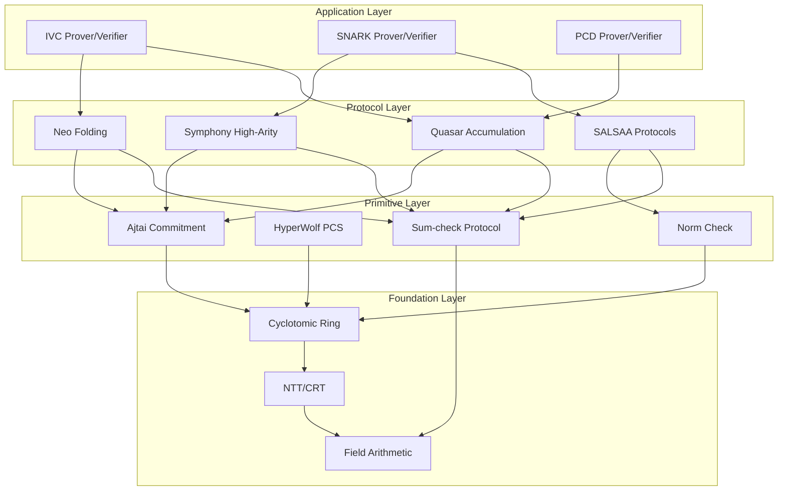

# Design Document: Neo Lattice zkVM Complete System

## Overview

This design document specifies the comprehensive architecture for the Neo Lattice zkVM - a complete post-quantum secure zero-knowledge virtual machine synthesizing cutting-edge cryptographic primitives from five core research papers:

1. **Quasar** - Sublinear Accumulation Schemes for Multiple Instances
2. **SALSAA** - Sumcheck-Aided Lattice-based Succinct Arguments and Applications
3. **Sum-check Survey** - Fast Provers in SNARK Design
4. **Neo** - Lattice-based folding scheme for CCS over small fields
5. **Symphony** - Scalable SNARKs from lattice-based high-arity folding

The system achieves post-quantum security under Ring-SIS and Ring-LWE assumptions while providing concrete efficiency competitive with pairing-based systems.

---

## Architecture

### High-Level System Architecture

```
┌─────────────────────────────────────────────────────────────────────────────┐
│                         Neo Lattice zkVM System                              │
├─────────────────────────────────────────────────────────────────────────────┤
│  ┌─────────────────┐  ┌─────────────────┐  ┌─────────────────┐              │
│  │   Application   │  │   Application   │  │   Application   │              │
│  │   Layer: IVC    │  │  Layer: SNARK   │  │  Layer: PCD     │              │
│  └────────┬────────┘  └────────┬────────┘  └────────┬────────┘              │
│           │                    │                    │                        │
│  ┌────────▼────────────────────▼────────────────────▼────────┐              │
│  │              Protocol Composition Layer                    │              │
│  │  ┌──────────┐ ┌──────────┐ ┌──────────┐ ┌──────────┐      │              │
│  │  │ Quasar   │ │ Symphony │ │  Neo     │ │ SALSAA   │      │              │
│  │  │Accum.    │ │High-Arity│ │ Folding  │ │ Sum-check│      │              │
│  │  └──────────┘ └──────────┘ └──────────┘ └──────────┘      │              │
│  └────────────────────────────┬──────────────────────────────┘              │
│                               │                                              │
│  ┌────────────────────────────▼──────────────────────────────┐              │
│  │              Core Cryptographic Primitives                 │              │
│  │  ┌──────────────┐ ┌──────────────┐ ┌──────────────┐       │              │
│  │  │ Ajtai        │ │ HyperWolf    │ │ Sum-check    │       │              │
│  │  │ Commitment   │ │ PCS          │ │ Protocol     │       │              │
│  │  └──────────────┘ └──────────────┘ └──────────────┘       │              │
│  └────────────────────────────┬──────────────────────────────┘              │
│                               │                                              │
│  ┌────────────────────────────▼──────────────────────────────┐              │
│  │              Ring Arithmetic Foundation                    │              │
│  │  ┌──────────────┐ ┌──────────────┐ ┌──────────────┐       │              │
│  │  │ Cyclotomic   │ │ NTT/CRT      │ │ Norm         │       │              │
│  │  │ Ring R_q     │ │ Operations   │ │ Tracking     │       │              │
│  │  └──────────────┘ └──────────────┘ └──────────────┘       │              │
│  └───────────────────────────────────────────────────────────┘              │
└─────────────────────────────────────────────────────────────────────────────┘
```


### Module Dependency Graph



---

## Components and Interfaces

### 1. Cyclotomic Ring Arithmetic Module

**Purpose**: Provides the algebraic foundation for all lattice-based protocols.

**Key Structures**:

```rust
/// Cyclotomic ring R_q = Z_q[X]/(X^φ + 1)
pub struct CyclotomicRing<const PHI: usize> {
    /// Coefficients in balanced representation [-(q-1)/2, (q-1)/2]
    coefficients: [i64; PHI],
    /// Prime modulus q with q ≡ 1 (mod 2φ)
    modulus: u64,
}

/// Ring element in NTT domain for fast multiplication
pub struct NTTElement<const PHI: usize> {
    /// Evaluations at primitive roots of unity
    evaluations: [u64; PHI],
    /// Precomputed twiddle factors
    twiddles: &'static TwiddleFactors<PHI>,
}

/// CRT decomposition R_q ≅ (F_{q^e})^{φ/e}
pub struct CRTDecomposition<const PHI: usize, const E: usize> {
    /// Components in extension field
    components: [ExtensionFieldElement<E>; PHI / E],
}

/// Canonical embedding σ: R → C^φ
pub struct CanonicalEmbedding<const PHI: usize> {
    /// Complex embeddings for norm computation
    embeddings: [Complex64; PHI],
}
```

**Core Operations**:

```rust
pub trait RingArithmetic<const PHI: usize> {
    /// Ring addition with modular reduction
    fn add(&self, other: &Self) -> Self;
    
    /// Ring subtraction with balanced representation
    fn sub(&self, other: &Self) -> Self;
    
    /// Ring multiplication via NTT: O(φ log φ)
    fn mul(&self, other: &Self) -> Self;
    
    /// Convert to NTT domain
    fn to_ntt(&self) -> NTTElement<PHI>;
    
    /// Convert from NTT domain
    fn from_ntt(ntt: &NTTElement<PHI>) -> Self;
    
    /// Compute CRT decomposition
    fn to_crt<const E: usize>(&self) -> CRTDecomposition<PHI, E>;
    
    /// Compute canonical norm ||x||_{σ,2}
    fn canonical_norm(&self) -> f64;
    
    /// Compute Trace_{K/Q}(x)
    fn trace(&self) -> i64;
    
    /// Check if element is invertible
    fn is_invertible(&self) -> bool;
}
```


### 2. Ajtai Commitment Scheme Module

**Purpose**: Provides binding commitments under Ring-SIS assumption with pay-per-bit costs.

**Key Structures**:

```rust
/// Ajtai commitment key A ∈ R_q^{κ×n}
pub struct AjtaiCommitmentKey<const KAPPA: usize, const N: usize> {
    /// Random matrix sampled uniformly
    matrix: [[CyclotomicRing; N]; KAPPA],
    /// Norm bound for binding security
    norm_bound: f64,
}

/// Commitment C = A·w where ||w|| ≤ β
pub struct AjtaiCommitment<const KAPPA: usize> {
    /// Commitment vector in R_q^κ
    value: [CyclotomicRing; KAPPA],
}

/// Neo's pay-per-bit matrix commitment
pub struct MatrixCommitment<const D: usize, const M: usize> {
    /// Commitment to matrix representation
    commitment: AjtaiCommitment<KAPPA>,
    /// Dimension parameters
    rows: usize,
    cols: usize,
}

/// Opening proof for Ajtai commitment
pub struct AjtaiOpening<const N: usize> {
    /// Witness vector with ||w|| ≤ β
    witness: [CyclotomicRing; N],
    /// Norm bound certificate
    norm_bound: f64,
}
```

**Core Operations**:

```rust
pub trait AjtaiCommitmentScheme {
    /// Generate commitment key: A ←$ R_q^{κ×m}
    fn setup(security_param: usize, message_len: usize) -> AjtaiCommitmentKey;
    
    /// Commit to witness: C = A·w
    fn commit(key: &AjtaiCommitmentKey, witness: &[CyclotomicRing]) -> AjtaiCommitment;
    
    /// Verify commitment opening
    fn verify_opening(
        key: &AjtaiCommitmentKey,
        commitment: &AjtaiCommitment,
        opening: &AjtaiOpening,
    ) -> bool;
    
    /// Homomorphic addition: C(w₁) + C(w₂) = C(w₁ + w₂)
    fn add_commitments(c1: &AjtaiCommitment, c2: &AjtaiCommitment) -> AjtaiCommitment;
    
    /// Scalar multiplication for folding
    fn scalar_mul(c: &AjtaiCommitment, scalar: &CyclotomicRing) -> AjtaiCommitment;
}

/// Neo's pay-per-bit commitment interface
pub trait PayPerBitCommitment {
    /// Transform field vector to matrix for efficient commitment
    fn vector_to_matrix(v: &[FieldElement], bit_width: usize) -> Matrix;
    
    /// Commit with cost O(k·log q + log n) for k non-zero entries
    fn commit_sparse(key: &AjtaiCommitmentKey, matrix: &Matrix) -> MatrixCommitment;
    
    /// Fold evaluation claims: {(C_i, r, y_i)} → (C, r, y)
    fn fold_evaluation_claims(
        claims: &[(AjtaiCommitment, EvaluationPoint, FieldElement)],
        challenge: &CyclotomicRing,
    ) -> (AjtaiCommitment, EvaluationPoint, FieldElement);
}
```


### 3. SALSAA Sum-Check Protocol Module

**Purpose**: Implements linear-time sum-check with norm verification for lattice arguments.

**Key Structures**:

```rust
/// Sum-check claim: Σ_{z∈[d]^μ} g(z) = t
pub struct SumcheckClaim<const MU: usize> {
    /// Target sum value
    target: CyclotomicRing,
    /// Polynomial degree bound per variable
    degree_bound: usize,
    /// Number of variables
    num_vars: usize,
}

/// Round polynomial g_j(X) in sum-check
pub struct RoundPolynomial {
    /// Coefficients of degree ≤ 2(d-1) polynomial
    coefficients: Vec<FieldElement>,
}

/// Sum-check proof transcript
pub struct SumcheckProof<const MU: usize> {
    /// Round polynomials g_1, ..., g_μ
    round_polynomials: Vec<RoundPolynomial>,
    /// Final evaluation claims
    final_claims: Vec<EvaluationClaim>,
}

/// Norm-check relation Ξ_norm
pub struct NormCheckRelation {
    /// Linear relation (H, F, Y)
    linear_relation: LinearRelation,
    /// Norm bound ν
    norm_bound: f64,
    /// Witness matrix W
    witness: WitnessMatrix,
}

/// LDE relation Ξ_lde-⊗
pub struct LDERelation {
    /// Base linear relation
    linear_relation: LinearRelation,
    /// Evaluation points and values
    evaluation_claims: Vec<(EvaluationPoint, FieldElement, StructuredMatrix)>,
}

/// Sumcheck relation Ξ_sum
pub struct SumcheckRelation {
    /// Base linear relation
    linear_relation: LinearRelation,
    /// Sumcheck target
    target: CyclotomicRing,
}
```

**Core Operations**:

```rust
pub trait SumcheckProtocol {
    /// Prove sum-check claim with O(m) prover complexity
    fn prove(
        claim: &SumcheckClaim,
        polynomial: &MultilinearPolynomial,
        transcript: &mut Transcript,
    ) -> SumcheckProof;
    
    /// Verify sum-check proof with O(μ·d) operations
    fn verify(
        claim: &SumcheckClaim,
        proof: &SumcheckProof,
        transcript: &mut Transcript,
    ) -> Result<EvaluationClaim, VerificationError>;
    
    /// Batch multiple norm checks using random linear combination
    fn batch_norm_checks(
        claims: &[NormCheckClaim],
        randomness: &[FieldElement],
    ) -> SumcheckClaim;
}

/// SALSAA norm-check RoK: Ξ_norm → Ξ_sum
pub trait NormCheckRoK {
    /// Reduce norm relation to sumcheck using ||x||²_{σ,2} = Trace(⟨x,x⟩)
    fn reduce_norm_to_sumcheck(
        norm_relation: &NormCheckRelation,
        transcript: &mut Transcript,
    ) -> (SumcheckRelation, NormCheckProof);
    
    /// Verify norm-check reduction
    fn verify_norm_reduction(
        norm_relation: &NormCheckRelation,
        sumcheck_relation: &SumcheckRelation,
        proof: &NormCheckProof,
        transcript: &mut Transcript,
    ) -> bool;
}

/// SALSAA sumcheck RoK: Ξ_sum → Ξ_lde-⊗
pub trait SumcheckRoK {
    /// Reduce sumcheck to LDE evaluation claims
    fn reduce_sumcheck_to_lde(
        sumcheck_relation: &SumcheckRelation,
        transcript: &mut Transcript,
    ) -> (LDERelation, SumcheckProof);
    
    /// Knowledge error: κ = (2μ(d-1)+rφ/e-1)/q^e
    fn knowledge_error(&self) -> f64;
}

/// SALSAA batching protocol Π*_batch
pub trait ImprovedBatching {
    /// Express bottom rows as sumcheck claims
    fn batch_linear_relations(
        relations: &[LinearRelation],
        transcript: &mut Transcript,
    ) -> SumcheckClaim;
}
```


### 4. Neo Folding Scheme Module

**Purpose**: Implements lattice-based folding for CCS over small fields with pay-per-bit commitments.

**Key Structures**:

```rust
/// CCS instance: Σ_i c_i · (Π_{j∈S_i} M_j · z) = 0
pub struct CCSInstance {
    /// Constraint matrices M_1, ..., M_t
    matrices: Vec<SparseMatrix>,
    /// Selector sets S_1, ..., S_q
    selectors: Vec<Vec<usize>>,
    /// Coefficients c_1, ..., c_q
    coefficients: Vec<FieldElement>,
    /// Public input
    public_input: Vec<FieldElement>,
}

/// CCS witness
pub struct CCSWitness {
    /// Private witness vector
    witness: Vec<FieldElement>,
    /// Commitment to witness
    commitment: AjtaiCommitment,
}

/// Folded CCS instance
pub struct FoldedCCSInstance {
    /// Accumulated instance
    instance: CCSInstance,
    /// Folding challenge τ
    challenge: Vec<FieldElement>,
    /// Error term from folding
    error: FieldElement,
}

/// Union polynomial w̃_∪(Y,X) = Σ_{k∈[ℓ]} eq̃_{k-1}(Y)·w̃^(k)(X)
pub struct UnionPolynomial {
    /// Multilinear extension of union
    coefficients: Vec<FieldElement>,
    /// Number of folded instances
    num_instances: usize,
}

/// Neo folding proof
pub struct NeoFoldingProof {
    /// Sumcheck proof for CCS reduction
    sumcheck_proof: SumcheckProof,
    /// Decomposition proof for norm bounds
    decomposition_proof: DecompositionProof,
    /// Evaluation claims
    evaluation_claims: Vec<EvaluationClaim>,
}

/// Decomposition for norm control
pub struct DecompositionProof {
    /// Decomposed vectors with ||w'_j|| ≤ b
    decomposed_witnesses: Vec<Vec<CyclotomicRing>>,
    /// Base for decomposition
    base: usize,
    /// Number of digits k = O(log(ℓ·β))
    num_digits: usize,
}
```

**Core Operations**:

```rust
/// Neo folding scheme for CCS
pub trait NeoFoldingScheme {
    /// Fold ℓ CCS instances into one
    fn fold(
        instances: &[CCSInstance],
        witnesses: &[CCSWitness],
        transcript: &mut Transcript,
    ) -> (FoldedCCSInstance, CCSWitness, NeoFoldingProof);
    
    /// Verify folding proof
    fn verify_fold(
        instances: &[CCSInstance],
        folded: &FoldedCCSInstance,
        proof: &NeoFoldingProof,
        transcript: &mut Transcript,
    ) -> bool;
    
    /// Compute union polynomial
    fn compute_union_polynomial(
        witnesses: &[CCSWitness],
    ) -> UnionPolynomial;
    
    /// Evaluate folded witness: w̃(X) = w̃_∪(τ,X)
    fn evaluate_folded_witness(
        union: &UnionPolynomial,
        challenge: &[FieldElement],
    ) -> Vec<FieldElement>;
}

/// CCS reduction protocol Π_CCS
pub trait CCSReduction {
    /// Reduce CCS satisfiability to evaluation claims via sumcheck
    fn reduce_ccs_to_evaluation(
        instance: &CCSInstance,
        witness: &CCSWitness,
        transcript: &mut Transcript,
    ) -> (Vec<EvaluationClaim>, SumcheckProof);
}

/// Random linear combination reduction Π_RLC
pub trait RLCReduction {
    /// Combine multiple evaluation claims
    fn combine_evaluation_claims(
        claims: &[EvaluationClaim],
        challenge: &FieldElement,
    ) -> EvaluationClaim;
}

/// Decomposition reduction Π_DEC
pub trait DecompositionReduction {
    /// Decompose witness to ensure norm bounds
    fn decompose_witness(
        witness: &CCSWitness,
        target_norm: f64,
        base: usize,
    ) -> (Vec<CCSWitness>, DecompositionProof);
    
    /// Verify decomposition
    fn verify_decomposition(
        original_commitment: &AjtaiCommitment,
        decomposed_commitments: &[AjtaiCommitment],
        proof: &DecompositionProof,
    ) -> bool;
}

/// Challenge set construction for small fields
pub trait ChallengeSetConstruction {
    /// Construct challenge set ensuring invertibility of differences
    fn construct_challenge_set(field_size: u64) -> ChallengeSet;
    
    /// Sample challenge from set
    fn sample_challenge(set: &ChallengeSet, transcript: &mut Transcript) -> FieldElement;
}
```


### 5. Quasar Sublinear Accumulation Module

**Purpose**: Implements sublinear accumulation for multi-instance IVC with O(log ℓ) verifier complexity.

**Key Structures**:

```rust
/// Multi-instance accumulator
pub struct QuasarAccumulator {
    /// Accumulated instance
    instance: AccumulatorInstance,
    /// Union polynomial commitment
    union_commitment: PolynomialCommitment,
    /// Accumulated witness polynomial
    witness_polynomial: MultilinearPolynomial,
}

/// Accumulator instance
pub struct AccumulatorInstance {
    /// Public input x
    public_input: Vec<FieldElement>,
    /// Folding challenge τ
    challenge: Vec<FieldElement>,
    /// Evaluation point r_x
    evaluation_point: Vec<FieldElement>,
    /// Error term e
    error: FieldElement,
}

/// Multi-cast reduction output
pub struct MultiCastOutput {
    /// Committed relation instance
    committed_instance: CommittedInstance,
    /// Union polynomial oracle
    union_oracle: PolynomialOracle,
    /// Witness polynomial oracle
    witness_oracle: PolynomialOracle,
}

/// Oracle batching proof
pub struct OracleBatchingProof {
    /// Batched evaluation proof (sublinear in polynomial length)
    evaluation_proof: Vec<FieldElement>,
    /// Random linear combination coefficients
    rlc_coefficients: Vec<FieldElement>,
}

/// 2-to-1 folding reduction
pub struct TwoToOneFoldingProof {
    /// Sumcheck proof for combining claims
    sumcheck_proof: SumcheckProof,
    /// Oracle batching proofs
    batching_proofs: Vec<OracleBatchingProof>,
}
```

**Core Operations**:

```rust
/// Quasar multi-instance accumulation scheme
pub trait QuasarAccumulation {
    /// Accumulate ℓ instances with O(log ℓ) verifier complexity
    fn accumulate(
        instances: &[PredicateInstance],
        old_accumulator: &QuasarAccumulator,
        transcript: &mut Transcript,
    ) -> (QuasarAccumulator, AccumulationProof);
    
    /// Verify accumulation with O(log ℓ) random oracle queries
    fn verify_accumulation(
        instances: &[PredicateInstance],
        old_accumulator: &AccumulatorInstance,
        new_accumulator: &AccumulatorInstance,
        proof: &AccumulationProof,
        transcript: &mut Transcript,
    ) -> bool;
    
    /// Final decision on accumulator validity
    fn decide(accumulator: &QuasarAccumulator) -> bool;
}

/// Multi-cast reduction IOR_multicast: R^ℓ → R^cm_acc
pub trait MultiCastReduction {
    /// Transform multi-instance relation to committed relation
    fn multi_cast(
        instances: &[(Instance, Witness)],
        transcript: &mut Transcript,
    ) -> (MultiCastOutput, MultiCastProof);
    
    /// Compute union polynomial w̃_∪(Y,X)
    fn compute_union_polynomial(
        witnesses: &[Witness],
    ) -> UnionPolynomial;
    
    /// Verify partial evaluation: w̃_∪(τ, r_x) = w̃(r_x)
    fn verify_partial_evaluation(
        union_commitment: &PolynomialCommitment,
        witness_commitment: &PolynomialCommitment,
        challenge: &[FieldElement],
        evaluation_point: &[FieldElement],
    ) -> bool;
}

/// 2-to-1 reduction IOR_fold: (R^cm_acc)² → R^cm_acc
pub trait TwoToOneFolding {
    /// Reduce 2 accumulators to 1 with O(1) verifier work
    fn fold_two_to_one(
        acc1: &QuasarAccumulator,
        acc2: &QuasarAccumulator,
        transcript: &mut Transcript,
    ) -> (QuasarAccumulator, TwoToOneFoldingProof);
    
    /// Verify 2-to-1 folding
    fn verify_fold(
        acc1: &AccumulatorInstance,
        acc2: &AccumulatorInstance,
        result: &AccumulatorInstance,
        proof: &TwoToOneFoldingProof,
        transcript: &mut Transcript,
    ) -> bool;
}

/// Oracle batching reduction IOR_batch
pub trait OracleBatching {
    /// Batch oracle openings with sublinear proof size
    fn batch_openings(
        commitments: &[PolynomialCommitment],
        points: &[Vec<FieldElement>],
        values: &[FieldElement],
        transcript: &mut Transcript,
    ) -> OracleBatchingProof;
    
    /// Verify batched openings
    fn verify_batch(
        commitments: &[PolynomialCommitment],
        points: &[Vec<FieldElement>],
        values: &[FieldElement],
        proof: &OracleBatchingProof,
        transcript: &mut Transcript,
    ) -> bool;
}
```


### 6. Symphony High-Arity Folding Module

**Purpose**: Implements hash-free high-arity folding via CP-SNARK compilation for scalable SNARKs.

**Key Structures**:

```rust
/// High-arity folding input (ℓ_np R1CS statements)
pub struct HighArityFoldingInput {
    /// R1CS instances to fold
    instances: Vec<R1CSInstance>,
    /// Corresponding witnesses
    witnesses: Vec<R1CSWitness>,
    /// Number of statements ℓ_np
    num_statements: usize,
}

/// Committed R1CS relation
pub struct CommittedR1CSRelation {
    /// Public input
    public_input: Vec<FieldElement>,
    /// Commitment to witness
    commitment: AjtaiCommitment,
    /// R1CS matrices (A, B, C)
    matrices: (SparseMatrix, SparseMatrix, SparseMatrix),
}

/// Monomial embedding for range proofs
pub struct MonomialEmbedding {
    /// Table polynomial t(X) = Σ_{i∈[1,d/2)} i·(X^i + X^{-i})
    table_polynomial: Vec<CyclotomicRing>,
    /// Monomial set M = {0, 1, X, ..., X^{d-1}}
    monomial_set: Vec<CyclotomicRing>,
}

/// Random projection for norm verification
pub struct RandomProjection {
    /// Structured projection J = I_{n/ℓ_h} ⊗ J'
    projection_matrix: StructuredMatrix,
    /// Narrow random matrix J' ∈ {0,±1}^{λ_pj × ℓ_h}
    narrow_matrix: Vec<Vec<i8>>,
}

/// CP-SNARK proof
pub struct CPSNARKProof {
    /// Commitments to Fiat-Shamir messages
    fs_commitments: Vec<Commitment>,
    /// Folded instance
    folded_instance: FoldedInstance,
    /// SNARK proof for reduced relation
    snark_proof: SNARKProof,
}

/// Two-layer folding output
pub struct TwoLayerFoldingOutput {
    /// First layer CP-SNARK proof
    first_layer_proof: CPSNARKProof,
    /// Second layer CP-SNARK proof
    second_layer_proof: CPSNARKProof,
    /// Final SNARK proof
    final_snark_proof: SNARKProof,
}
```

**Core Operations**:

```rust
/// Symphony high-arity folding scheme
pub trait SymphonyFolding {
    /// Fold ℓ_np R1CS statements in single shot
    fn fold_high_arity(
        input: &HighArityFoldingInput,
        transcript: &mut Transcript,
    ) -> (FoldedInstance, FoldedWitness, HighArityFoldingProof);
    
    /// Three-step folding process
    fn fold_three_steps(
        instances: &[R1CSInstance],
        witnesses: &[R1CSWitness],
        transcript: &mut Transcript,
    ) -> FoldingResult {
        // Step 1: Commitment
        let commitments = self.commit_witnesses(witnesses);
        
        // Step 2: Sumcheck reduction
        let (sumcheck_claims, sumcheck_proof) = 
            self.reduce_to_sumcheck(instances, witnesses, transcript);
        
        // Step 3: Random linear combination
        let (folded, rlc_proof) = 
            self.random_linear_combine(sumcheck_claims, transcript);
        
        FoldingResult { commitments, sumcheck_proof, folded, rlc_proof }
    }
}

/// Monomial embedding range proof
pub trait MonomialRangeProof {
    /// Prove vector entries are in range (-d/2, d/2)
    fn prove_range(
        commitment: &AjtaiCommitment,
        witness: &[CyclotomicRing],
        transcript: &mut Transcript,
    ) -> MonomialRangeProof;
    
    /// Verify range proof using table polynomial
    fn verify_range(
        commitment: &AjtaiCommitment,
        proof: &MonomialRangeProof,
        transcript: &mut Transcript,
    ) -> bool;
    
    /// Compute table polynomial t(X)
    fn compute_table_polynomial(degree: usize) -> Vec<CyclotomicRing>;
}

/// Structured random projection
pub trait StructuredRandomProjection {
    /// Apply structured projection J·w mod q
    fn project(
        witness: &[CyclotomicRing],
        projection: &RandomProjection,
    ) -> Vec<CyclotomicRing>;
    
    /// Verify projection preserves norm bounds
    fn verify_projection(
        original_commitment: &AjtaiCommitment,
        projected_commitment: &AjtaiCommitment,
        projection: &RandomProjection,
        norm_bound: f64,
    ) -> bool;
}

/// CP-SNARK compiler: Folding → SNARK without Fiat-Shamir circuit
pub trait CPSNARKCompiler {
    /// Convert folding scheme to SNARK
    fn compile_to_snark(
        folding_scheme: &impl FoldingScheme,
        commitment_scheme: &impl CommitmentScheme,
    ) -> CPSNARKScheme;
    
    /// Prove with CP-SNARK (no hash embedding)
    fn prove(
        instances: &[Instance],
        witnesses: &[Witness],
        transcript: &mut Transcript,
    ) -> CPSNARKProof;
    
    /// Verify CP-SNARK proof
    fn verify(
        instances: &[Instance],
        proof: &CPSNARKProof,
        transcript: &mut Transcript,
    ) -> bool;
}

/// Two-layer folding for higher depths
pub trait TwoLayerFolding {
    /// Split reduced statement to multiple uniform NP statements
    fn split_statement(
        reduced_instance: &FoldedInstance,
        reduced_witness: &FoldedWitness,
    ) -> Vec<(Instance, Witness)>;
    
    /// Apply second layer folding
    fn fold_second_layer(
        split_statements: &[(Instance, Witness)],
        transcript: &mut Transcript,
    ) -> TwoLayerFoldingOutput;
}

/// Streaming prover with O(n) space
pub trait StreamingProver {
    /// Prove with 2 + log log(n) passes over input
    fn prove_streaming(
        input_stream: impl Iterator<Item = FieldElement>,
        transcript: &mut Transcript,
    ) -> StreamingProof;
    
    /// Memory requirement: O(n) space
    fn memory_requirement(input_size: usize) -> usize;
}
```


### 7. Sum-check Optimizations Module (from Survey)

**Purpose**: Implements fast prover techniques from "Sum-check Is All You Need" survey.

**Key Structures**:

```rust
/// Dynamic programming state for linear-time prover
pub struct DynamicProgrammingState {
    /// Evaluation arrays A and B (halve each round)
    eval_arrays: (Vec<FieldElement>, Vec<FieldElement>),
    /// Current round
    current_round: usize,
    /// Accumulated challenges
    challenges: Vec<FieldElement>,
}

/// Sparse sum-check state
pub struct SparseSumcheckState {
    /// Non-zero term indices
    nonzero_indices: Vec<usize>,
    /// Sparsity T (number of non-zero terms)
    sparsity: usize,
    /// Total terms N = 2^n
    total_terms: usize,
}

/// Virtual polynomial (not materialized)
pub struct VirtualPolynomial {
    /// Base committed polynomials
    base_polynomials: Vec<PolynomialCommitment>,
    /// Composition function
    composition: Box<dyn Fn(&[FieldElement]) -> FieldElement>,
}

/// Batch evaluation argument
pub struct BatchEvaluationArgument {
    /// Read values z_1, ..., z_T
    read_values: Vec<FieldElement>,
    /// Access matrix (one-hot representation)
    access_matrix: SparseMatrix,
    /// Function f being evaluated
    function: Box<dyn Fn(&[bool]) -> FieldElement>,
}

/// Memory checking state
pub struct MemoryCheckingState {
    /// Address vector
    addresses: Vec<usize>,
    /// Value vector
    values: Vec<FieldElement>,
    /// Timestamp vector for consistency
    timestamps: Vec<u64>,
}
```

**Core Operations**:

```rust
/// Linear-time sum-check prover (Thaler's optimization)
pub trait LinearTimeSumcheckProver {
    /// Initialize with O(N) evaluations
    fn initialize(
        p_evals: Vec<FieldElement>,
        q_evals: Vec<FieldElement>,
    ) -> DynamicProgrammingState;
    
    /// Process round i with O(N/2^i) work
    fn process_round(
        state: &mut DynamicProgrammingState,
        challenge: FieldElement,
    ) -> RoundPolynomial;
    
    /// Total work: O(N + N/2 + N/4 + ... + 1) = O(N)
    fn total_work(num_terms: usize) -> usize {
        2 * num_terms - 1
    }
}

/// Sparse sum-check prover
pub trait SparseSumcheckProver {
    /// Initialize with T non-zero terms
    fn initialize_sparse(
        nonzero_terms: Vec<(Vec<bool>, FieldElement)>,
    ) -> SparseSumcheckState;
    
    /// Prove with O(T) work instead of O(N)
    fn prove_sparse(
        state: &SparseSumcheckState,
        transcript: &mut Transcript,
    ) -> SumcheckProof;
    
    /// Prefix-suffix algorithm for structured sparsity
    fn prefix_suffix_prove(
        state: &SparseSumcheckState,
        transcript: &mut Transcript,
    ) -> SumcheckProof;
}

/// Virtual polynomial framework
pub trait VirtualPolynomialFramework {
    /// Create virtual polynomial without materializing
    fn create_virtual(
        base: &[PolynomialCommitment],
        composition: impl Fn(&[FieldElement]) -> FieldElement,
    ) -> VirtualPolynomial;
    
    /// Evaluate virtual polynomial at point
    fn evaluate_virtual(
        virtual_poly: &VirtualPolynomial,
        point: &[FieldElement],
    ) -> FieldElement;
    
    /// Reduce commitment costs by avoiding materialization
    fn commitment_cost_reduction(
        original_size: usize,
        virtual_size: usize,
    ) -> f64;
}

/// Batch evaluation argument (Shout-style)
pub trait BatchEvaluationProtocol {
    /// Prove batch evaluation: z_i = f(y_i) for all i
    fn prove_batch_evaluation(
        argument: &BatchEvaluationArgument,
        transcript: &mut Transcript,
    ) -> BatchEvaluationProof;
    
    /// Verify batch evaluation
    fn verify_batch_evaluation(
        argument: &BatchEvaluationArgument,
        proof: &BatchEvaluationProof,
        transcript: &mut Transcript,
    ) -> bool;
    
    /// Reduce to single evaluation: Σ_x ra(x,r')·f(x)
    fn reduce_to_single_evaluation(
        argument: &BatchEvaluationArgument,
        challenge: &[FieldElement],
    ) -> EvaluationClaim;
}

/// Memory checking protocol
pub trait MemoryCheckingProtocol {
    /// Prove read operations: mem[addr] = value
    fn prove_reads(
        state: &MemoryCheckingState,
        transcript: &mut Transcript,
    ) -> MemoryReadProof;
    
    /// Prove write operations with timestamp consistency
    fn prove_writes(
        state: &MemoryCheckingState,
        transcript: &mut Transcript,
    ) -> MemoryWriteProof;
    
    /// One-hot addressing representation
    fn to_one_hot(address: usize, memory_size: usize) -> Vec<bool>;
    
    /// Increment checking for timestamp monotonicity
    fn verify_timestamps(timestamps: &[u64]) -> bool;
}

/// Small-value preservation
pub trait SmallValuePreservation {
    /// Leverage witness bit-width for faster commitment
    fn commit_small_values(
        values: &[FieldElement],
        bit_width: usize,
        key: &CommitmentKey,
    ) -> Commitment;
    
    /// Cost reduction factor for small values
    fn cost_reduction_factor(full_width: usize, actual_width: usize) -> f64 {
        full_width as f64 / actual_width as f64
    }
}
```


---

## Data Models

### Field and Ring Elements

```rust
/// Prime field element F_q
#[derive(Clone, Copy, Debug, PartialEq, Eq)]
pub struct FieldElement {
    /// Value in [0, q-1]
    value: u64,
    /// Field modulus
    modulus: u64,
}

/// Supported small prime fields
pub enum SupportedField {
    /// Goldilocks: 2^64 - 2^32 + 1
    Goldilocks,
    /// Mersenne-61: 2^61 - 1
    M61,
    /// Almost Goldilocks: (2^64 - 2^32 + 1) - 32
    AlmostGoldilocks,
    /// BabyBear: 2^31 - 2^27 + 1
    BabyBear,
}

/// Extension field element F_{q^e}
#[derive(Clone, Debug)]
pub struct ExtensionFieldElement<const E: usize> {
    /// Coefficients in base field
    coefficients: [FieldElement; E],
}

/// Cyclotomic ring element R_q = Z_q[X]/(X^φ + 1)
#[derive(Clone, Debug)]
pub struct RingElement<const PHI: usize> {
    /// Coefficients in balanced representation
    coefficients: [i64; PHI],
    /// Ring modulus
    modulus: u64,
}

/// Tensor of rings E = K ⊗_{F_q} R_q
#[derive(Clone, Debug)]
pub struct TensorElement<const T: usize, const D: usize> {
    /// Matrix representation in Z_q^{t×d}
    matrix: [[FieldElement; D]; T],
}
```

### Polynomial Representations

```rust
/// Multilinear polynomial in evaluation form
#[derive(Clone, Debug)]
pub struct MultilinearPolynomial {
    /// Evaluations over Boolean hypercube {0,1}^n
    evaluations: Vec<FieldElement>,
    /// Number of variables
    num_vars: usize,
}

/// Low-degree extension LDE[w]: K^μ → K
#[derive(Clone, Debug)]
pub struct LowDegreeExtension {
    /// Witness vector w
    witness: Vec<RingElement>,
    /// Degree bound d
    degree_bound: usize,
    /// Number of variables μ
    num_vars: usize,
}

/// Univariate polynomial for sum-check rounds
#[derive(Clone, Debug)]
pub struct UnivariatePolynomial {
    /// Coefficients [a_0, a_1, ..., a_d]
    coefficients: Vec<FieldElement>,
}

/// Equality polynomial eq̃(X,Y)
#[derive(Clone, Debug)]
pub struct EqualityPolynomial {
    /// Evaluation point
    point: Vec<FieldElement>,
}

impl EqualityPolynomial {
    /// Compute eq̃(r,x) = Π_i ((1-r_i)(1-x_i) + r_i·x_i)
    pub fn evaluate(&self, x: &[FieldElement]) -> FieldElement {
        self.point.iter().zip(x.iter())
            .map(|(r, xi)| {
                let one_minus_r = FieldElement::one() - *r;
                let one_minus_x = FieldElement::one() - *xi;
                one_minus_r * one_minus_x + *r * *xi
            })
            .fold(FieldElement::one(), |acc, v| acc * v)
    }
}
```

### Constraint Systems

```rust
/// R1CS constraint system: Az ⊙ Bz = Cz
#[derive(Clone, Debug)]
pub struct R1CSConstraintSystem {
    /// Matrix A (sparse)
    a_matrix: SparseMatrix,
    /// Matrix B (sparse)
    b_matrix: SparseMatrix,
    /// Matrix C (sparse)
    c_matrix: SparseMatrix,
    /// Number of constraints
    num_constraints: usize,
    /// Number of variables
    num_variables: usize,
    /// Number of public inputs
    num_public_inputs: usize,
}

/// CCS constraint system: Σ_i c_i · (Π_{j∈S_i} M_j · z) = 0
#[derive(Clone, Debug)]
pub struct CCSConstraintSystem {
    /// Constraint matrices M_1, ..., M_t
    matrices: Vec<SparseMatrix>,
    /// Selector sets S_1, ..., S_q
    selectors: Vec<Vec<usize>>,
    /// Coefficients c_1, ..., c_q
    coefficients: Vec<FieldElement>,
    /// Number of constraints m
    num_constraints: usize,
    /// Number of variables n
    num_variables: usize,
    /// Degree d (max |S_i|)
    degree: usize,
}

/// Sparse matrix representation
#[derive(Clone, Debug)]
pub struct SparseMatrix {
    /// Row indices
    row_indices: Vec<usize>,
    /// Column indices
    col_indices: Vec<usize>,
    /// Values
    values: Vec<FieldElement>,
    /// Dimensions
    rows: usize,
    cols: usize,
}

/// Plonkish constraint with selectors
#[derive(Clone, Debug)]
pub struct PlonkishConstraint {
    /// Selector polynomials q_1, ..., q_k
    selectors: Vec<MultilinearPolynomial>,
    /// Wire polynomials w_1, ..., w_m
    wires: Vec<MultilinearPolynomial>,
    /// Custom gate function f(q, w) = 0
    gate_function: Box<dyn Fn(&[FieldElement], &[FieldElement]) -> FieldElement>,
}
```

### Proof Structures

```rust
/// Complete IVC proof
#[derive(Clone, Debug)]
pub struct IVCProof {
    /// Running accumulator
    accumulator: QuasarAccumulator,
    /// Folding proofs for each step
    folding_proofs: Vec<NeoFoldingProof>,
    /// Final SNARK proof (optional compression)
    final_proof: Option<SNARKProof>,
}

/// Complete SNARK proof
#[derive(Clone, Debug)]
pub struct SNARKProof {
    /// Commitment to witness
    witness_commitment: AjtaiCommitment,
    /// Sum-check proof
    sumcheck_proof: SumcheckProof,
    /// Evaluation proofs
    evaluation_proofs: Vec<EvaluationProof>,
    /// Norm proofs
    norm_proofs: Vec<NormProof>,
}

/// Evaluation claim
#[derive(Clone, Debug)]
pub struct EvaluationClaim {
    /// Commitment to polynomial
    commitment: PolynomialCommitment,
    /// Evaluation point
    point: Vec<FieldElement>,
    /// Claimed value
    value: FieldElement,
}

/// Norm bound proof
#[derive(Clone, Debug)]
pub struct NormProof {
    /// Sumcheck proof for norm verification
    sumcheck_proof: SumcheckProof,
    /// LDE evaluation claims
    lde_claims: Vec<EvaluationClaim>,
    /// Claimed norm bound
    norm_bound: f64,
}
```


---

## Correctness Properties

*A property is a characteristic or behavior that should hold true across all valid executions of a system-essentially, a formal statement about what the system should do. Properties serve as the bridge between human-readable specifications and machine-verifiable correctness guarantees.*

### Property 1: Ring Arithmetic Consistency
*For any* two ring elements a, b ∈ R_q, multiplication via NTT should produce the same result as direct polynomial multiplication: `from_ntt(to_ntt(a) ⊙ to_ntt(b)) = a · b mod (X^φ + 1, q)`
**Validates: Requirements 1.2**

### Property 2: Commitment Binding
*For any* commitment key A and commitment C, finding two distinct openings w ≠ w' with A·w = A·w' = C should require solving Ring-SIS
**Validates: Requirements 2.3**

### Property 3: Commitment Homomorphism
*For any* witnesses w₁, w₂ with valid commitments C₁, C₂, the sum C₁ + C₂ should be a valid commitment to w₁ + w₂
**Validates: Requirements 2.5**

### Property 4: Sum-check Soundness
*For any* false claim Σ_{z∈[d]^μ} g(z) ≠ t, a cheating prover should be caught with probability at least 1 - (2μ(d-1)+rφ/e-1)/q^e
**Validates: Requirements 4.1, 4.10**

### Property 5: Norm-check Correctness
*For any* witness W with ||W||_{σ,2} ≤ β, the norm-check protocol should accept, and for ||W||_{σ,2} > β, it should reject with overwhelming probability
**Validates: Requirements 4.7**

### Property 6: Folding Completeness
*For any* ℓ valid CCS instance-witness pairs, folding should produce a valid folded instance-witness pair
**Validates: Requirements 5.1, 5.2**

### Property 7: Folding Norm Bound
*For any* folding of ℓ instances with witnesses bounded by β, the folded witness norm should satisfy ||w'|| ≤ ℓ·||γ||·max_i||w_i|| where ||γ|| ≤ 2ℓ for subtractive challenges
**Validates: Requirements 5.3**

### Property 8: Accumulation Sublinearity
*For any* accumulation of ℓ instances, the verifier should perform O(log ℓ) random oracle queries and O(1) group operations
**Validates: Requirements 8.1, 8.2**

### Property 9: Union Polynomial Correctness
*For any* set of witness polynomials {w̃^(k)}, the union polynomial w̃_∪(Y,X) should satisfy w̃_∪(Bits(k), X) = w̃^(k)(X) for all k ∈ [ℓ]
**Validates: Requirements 8.7**

### Property 10: Partial Evaluation Verification
*For any* union polynomial and challenge τ, verifying w̃_∪(τ, r_x) = w̃(r_x) should have soundness error at most log(n)/|F|
**Validates: Requirements 8.8**

### Property 11: Pay-Per-Bit Cost Scaling
*For any* vector of k-bit values, commitment cost should be O(k·log q + log n), achieving 64× reduction for bits vs 64-bit values
**Validates: Requirements 5.7, 21.18**

### Property 12: High-Arity Folding Compression
*For any* ℓ_np R1CS statements, Symphony folding should compress to proof size ≤ 200KB for ℓ_np ≤ 2^10
**Validates: Requirements 7.7**

### Property 13: CP-SNARK Hash-Free Property
*For any* CP-SNARK proof, the proven statement should not embed Fiat-Shamir hash circuits
**Validates: Requirements 7.2, 7.10**

### Property 14: Streaming Prover Space Bound
*For any* input of size n, the streaming prover should require O(n) space with 2 + log log(n) passes
**Validates: Requirements 7.12, 14.3**

### Property 15: Linear-Time Prover Complexity
*For any* sum-check over N terms, the prover should perform O(N) field operations total with work halving each round
**Validates: Requirements 18.7**

### Property 16: Sparse Sum-check Efficiency
*For any* sparse sum with T non-zero terms out of N total, the prover should perform O(T + N^{1/c}) operations for constant c
**Validates: Requirements 18.11**

### Property 17: Knowledge Soundness
*For any* accepting proof, there exists an extractor recovering a valid witness with probability ≥ 1 - negl(λ)
**Validates: Requirements 19.3**

### Property 18: Zero-Knowledge Simulation
*For any* valid statement, there exists a PPT simulator S such that {S(stmt)} ≈_c {Prove(stmt, w)}
**Validates: Requirements 15.2**

### Property 19: Parameter Security Validation
*For any* parameter set (q, φ, β), the Hermite factor should be validated against Lattice Estimator for target security λ
**Validates: Requirements 17.1, 17.6**

### Property 20: CCS Reduction Correctness
*For any* CCS instance, the reduction Π_CCS should produce valid evaluation claims via single sum-check invocation
**Validates: Requirements 5.10, 21.20**

---

## Error Handling

### Error Categories

```rust
/// Top-level error type for Neo Lattice zkVM
#[derive(Debug, thiserror::Error)]
pub enum NeoError {
    #[error("Ring arithmetic error: {0}")]
    RingArithmetic(RingArithmeticError),
    
    #[error("Commitment error: {0}")]
    Commitment(CommitmentError),
    
    #[error("Sum-check error: {0}")]
    Sumcheck(SumcheckError),
    
    #[error("Folding error: {0}")]
    Folding(FoldingError),
    
    #[error("Accumulation error: {0}")]
    Accumulation(AccumulationError),
    
    #[error("Verification error: {0}")]
    Verification(VerificationError),
    
    #[error("Parameter error: {0}")]
    Parameter(ParameterError),
    
    #[error("Security error: {0}")]
    Security(SecurityError),
}

/// Ring arithmetic errors
#[derive(Debug, thiserror::Error)]
pub enum RingArithmeticError {
    #[error("Modulus not prime or q ≢ 1 (mod 2φ)")]
    InvalidModulus,
    
    #[error("Ring degree φ not power of 2")]
    InvalidDegree,
    
    #[error("NTT twiddle factor computation failed")]
    TwiddleFactorError,
    
    #[error("CRT decomposition failed: splitting degree {0} invalid")]
    CRTDecompositionError(usize),
    
    #[error("Element not invertible in ring")]
    NotInvertible,
    
    #[error("Coefficient overflow in balanced representation")]
    CoefficientOverflow,
}

/// Commitment errors
#[derive(Debug, thiserror::Error)]
pub enum CommitmentError {
    #[error("Witness norm {0} exceeds bound {1}")]
    NormBoundExceeded(f64, f64),
    
    #[error("Commitment key dimension mismatch")]
    DimensionMismatch,
    
    #[error("Opening verification failed")]
    OpeningVerificationFailed,
    
    #[error("Homomorphic operation failed: incompatible commitments")]
    HomomorphicOperationFailed,
    
    #[error("Pay-per-bit encoding failed")]
    PayPerBitEncodingFailed,
}

/// Sum-check errors
#[derive(Debug, thiserror::Error)]
pub enum SumcheckError {
    #[error("Round polynomial degree {0} exceeds bound {1}")]
    DegreeExceeded(usize, usize),
    
    #[error("Sum verification failed at round {0}")]
    SumVerificationFailed(usize),
    
    #[error("Final evaluation check failed")]
    FinalEvaluationFailed,
    
    #[error("Batching failed: incompatible claims")]
    BatchingFailed,
    
    #[error("LDE evaluation mismatch")]
    LDEEvaluationMismatch,
}

/// Folding errors
#[derive(Debug, thiserror::Error)]
pub enum FoldingError {
    #[error("Instance count {0} exceeds maximum arity {1}")]
    ArityExceeded(usize, usize),
    
    #[error("Witness decomposition failed")]
    DecompositionFailed,
    
    #[error("Challenge set construction failed for field size {0}")]
    ChallengeSetConstructionFailed(u64),
    
    #[error("Union polynomial computation failed")]
    UnionPolynomialFailed,
    
    #[error("Folded norm bound exceeded after {0} iterations")]
    FoldedNormExceeded(usize),
}

/// Accumulation errors
#[derive(Debug, thiserror::Error)]
pub enum AccumulationError {
    #[error("Multi-cast reduction failed")]
    MultiCastFailed,
    
    #[error("Oracle batching failed")]
    OracleBatchingFailed,
    
    #[error("Partial evaluation verification failed")]
    PartialEvaluationFailed,
    
    #[error("Decider check failed")]
    DeciderFailed,
    
    #[error("CRC operation limit exceeded")]
    CRCLimitExceeded,
}

/// Verification errors
#[derive(Debug, thiserror::Error)]
pub enum VerificationError {
    #[error("Proof malformed")]
    MalformedProof,
    
    #[error("Transcript mismatch")]
    TranscriptMismatch,
    
    #[error("Commitment verification failed")]
    CommitmentVerificationFailed,
    
    #[error("Evaluation proof invalid")]
    EvaluationProofInvalid,
    
    #[error("Norm proof invalid")]
    NormProofInvalid,
}

/// Parameter errors
#[derive(Debug, thiserror::Error)]
pub enum ParameterError {
    #[error("Security level {0} not achievable with parameters")]
    SecurityLevelUnachievable(usize),
    
    #[error("Modulus too small: q < 2·β·d^k for k={0} folding iterations")]
    ModulusTooSmall(usize),
    
    #[error("Field not supported: {0}")]
    UnsupportedField(String),
    
    #[error("Maximum folding depth {0} exceeded")]
    MaxFoldingDepthExceeded(usize),
}

/// Security errors
#[derive(Debug, thiserror::Error)]
pub enum SecurityError {
    #[error("Timing attack detected")]
    TimingAttackDetected,
    
    #[error("SIS break detected")]
    SISBreakDetected,
    
    #[error("Soundness error exceeds threshold")]
    SoundnessErrorExceeded,
    
    #[error("Challenge space too small")]
    ChallengeSpaceTooSmall,
}
```


---

## Testing Strategy

### Dual Testing Approach

The implementation requires both unit testing and property-based testing:

1. **Unit Tests**: Verify specific examples, edge cases, and error conditions
2. **Property-Based Tests**: Verify universal properties that should hold across all inputs

### Property-Based Testing Framework

The implementation will use the `proptest` crate for Rust property-based testing, configured to run a minimum of 100 iterations per property.

### Test Categories

#### 1. Ring Arithmetic Tests
- NTT round-trip consistency
- CRT decomposition correctness
- Norm computation accuracy
- Trace function correctness
- Invertibility detection

#### 2. Commitment Scheme Tests
- Binding property (computational)
- Homomorphic operations
- Pay-per-bit cost verification
- Norm bound enforcement

#### 3. Sum-check Protocol Tests
- Completeness for valid claims
- Soundness for invalid claims
- Linear-time prover verification
- Batching correctness

#### 4. Folding Scheme Tests
- Folding completeness
- Norm growth bounds
- Decomposition correctness
- Challenge set properties

#### 5. Accumulation Scheme Tests
- Sublinear verifier complexity
- Multi-cast reduction correctness
- Oracle batching succinctness
- Decider correctness

#### 6. Integration Tests
- End-to-end IVC proving
- SNARK generation and verification
- Streaming prover memory bounds
- Cross-module compatibility

### Test Annotation Format

Each property-based test must be annotated with:
```rust
/// **Feature: neo-lattice-zkvm, Property {number}: {property_text}**
/// **Validates: Requirements X.Y**
#[test]
fn test_property_name() {
    // Property-based test implementation
}
```

---

## Missing Components Analysis by Paper

### Quasar Missing Components

| Component | Status | Description | Implementation Priority |
|-----------|--------|-------------|------------------------|
| NIR_multicast | Missing | Multi-instance to committed relation reduction | High |
| IOR_batch succinctness | Missing | Sublinear proof size for oracle batching | High |
| Union polynomial commitment | Missing | Efficient commitment to w̃_∪(Y,X) | High |
| Partial evaluation verification | Missing | Check w̃_∪(τ, r_x) = w̃(r_x) | High |
| Linear-time encodable code integration | Missing | Post-quantum instantiation | Medium |
| CRC operation tracking | Missing | O(√N) total CRC across N steps | Medium |

### SALSAA Missing Components

| Component | Status | Description | Implementation Priority |
|-----------|--------|-------------|------------------------|
| Π_norm linear-time | Missing | Norm-check with O(m) prover | Critical |
| Ξ_lde and Ξ_lde-⊗ | Missing | LDE relations with structured matrices | Critical |
| Ξ_sum relation | Missing | Sumcheck relation over LDEs | Critical |
| Π*_batch | Missing | Improved batching via sumcheck | High |
| Π_lin-r1cs | Missing | R1CS to Ξ_lin reduction | High |
| AVX-512 NTT | Missing | Hardware-accelerated ring arithmetic | Medium |
| Dynamic programming prover | Missing | Thaler's optimization | High |

### Sum-check Survey Missing Components

| Component | Status | Description | Implementation Priority |
|-----------|--------|-------------|------------------------|
| Linear-time dense prover | Missing | O(N) total work with halving | Critical |
| Sparse sum-check | Missing | O(T) for T non-zero terms | High |
| Prefix-suffix algorithm | Missing | Streaming with O(√N) space | High |
| Virtual polynomial framework | Missing | Avoid materializing intermediates | High |
| Batch evaluation (Shout) | Missing | Read-only memory checking | Medium |
| Memory checking (Twist) | Missing | Read/write memory verification | Medium |
| Small-value preservation | Missing | Leverage witness bit-width | High |

### Neo Missing Components

| Component | Status | Description | Implementation Priority |
|-----------|--------|-------------|------------------------|
| Pay-per-bit Ajtai | Missing | Cost scaling with bit-width | Critical |
| Folding-friendly homomorphism | Missing | Fold β ≥ 2 evaluation claims | Critical |
| Π_CCS reduction | Missing | CCS to evaluation via sumcheck | Critical |
| Π_DEC decomposition | Missing | Witness decomposition for norms | High |
| Challenge set for small fields | Missing | Invertibility for Goldilocks, M61 | High |
| Extension field arithmetic | Missing | Degree-2 extensions of small primes | High |
| Matrix commitment scheme | Missing | Vector to matrix transformation | High |

### Symphony Missing Components

| Component | Status | Description | Implementation Priority |
|-----------|--------|-------------|------------------------|
| High-arity folding | Missing | Compress ℓ_np > 1 statements | Critical |
| Monomial embedding range proof | Missing | Table polynomial t(X) | High |
| Structured random projection | Missing | J = I_{n/ℓ_h} ⊗ J' | High |
| CP-SNARK compiler | Missing | Folding to SNARK without FS circuit | Critical |
| Two-layer folding | Missing | Split linear statements | High |
| Streaming prover | Missing | O(n) space, 2+log log(n) passes | Medium |
| Tensor-of-rings framework | Missing | Interleave sumcheck and folding | High |

---

## Concrete Parameter Recommendations

### Security Level λ = 128 bits

```rust
pub const PARAMS_128: SecurityParameters = SecurityParameters {
    // Ring parameters
    phi: 256,                    // Cyclotomic degree
    q: 0xFFFFFFFF00000001,      // Goldilocks prime
    extension_degree: 2,         // For 128-bit challenge space
    
    // Commitment parameters
    kappa: 4,                    // Commitment rows
    n: 1024,                     // Message length
    beta: 1 << 20,              // Norm bound
    
    // Folding parameters
    max_folding_arity: 1024,    // ℓ ≤ 2^10
    decomposition_base: 4,       // b = 4
    max_folding_depth: 10,       // Before overflow
    
    // Performance targets
    prover_throughput: 10000,    // constraints/second
    verification_time_ms: 50,    // milliseconds
    proof_size_kb: 100,          // kilobytes
};
```

### Security Level λ = 192 bits

```rust
pub const PARAMS_192: SecurityParameters = SecurityParameters {
    phi: 512,
    q: 0x1FFFFFFFFFFFFFFF,       // 61-bit Mersenne
    extension_degree: 4,
    kappa: 6,
    n: 2048,
    beta: 1 << 24,
    max_folding_arity: 512,
    decomposition_base: 4,
    max_folding_depth: 8,
    prover_throughput: 5000,
    verification_time_ms: 75,
    proof_size_kb: 150,
};
```

### Security Level λ = 256 bits

```rust
pub const PARAMS_256: SecurityParameters = SecurityParameters {
    phi: 1024,
    q: 0xFFFFFFFFFFFFFFFF,       // Near 64-bit
    extension_degree: 4,
    kappa: 8,
    n: 4096,
    beta: 1 << 28,
    max_folding_arity: 256,
    decomposition_base: 2,
    max_folding_depth: 6,
    prover_throughput: 2500,
    verification_time_ms: 100,
    proof_size_kb: 200,
};
```

### Norm Growth Analysis

For k folding iterations with arity ℓ:
- Initial norm: β₀
- After k folds: β_k ≤ (ℓ · ||γ||)^k · β₀
- Constraint: q > 2 · β_k · d^k

Maximum folding depth before overflow:
```
k_max = floor(log_q(q / (2 · β₀)) / log_q(ℓ · ||γ|| · d))
```

---

## API Design

### Builder Pattern Interfaces

```rust
/// IVC Builder
pub struct IVCBuilder {
    params: SecurityParameters,
    step_circuit: Box<dyn StepCircuit>,
    initial_state: Vec<FieldElement>,
}

impl IVCBuilder {
    pub fn new(params: SecurityParameters) -> Self;
    pub fn with_step_circuit(self, circuit: impl StepCircuit) -> Self;
    pub fn with_initial_state(self, state: Vec<FieldElement>) -> Self;
    pub fn build(self) -> Result<IVCScheme, NeoError>;
}

/// SNARK Builder
pub struct SNARKBuilder {
    params: SecurityParameters,
    constraint_system: ConstraintSystem,
}

impl SNARKBuilder {
    pub fn new(params: SecurityParameters) -> Self;
    pub fn with_r1cs(self, r1cs: R1CSConstraintSystem) -> Self;
    pub fn with_ccs(self, ccs: CCSConstraintSystem) -> Self;
    pub fn with_plonkish(self, plonkish: PlonkishConstraint) -> Self;
    pub fn build(self) -> Result<SNARKScheme, NeoError>;
}

/// PCD Builder
pub struct PCDBuilder {
    params: SecurityParameters,
    compliance_predicate: Box<dyn CompliancePredicate>,
}

impl PCDBuilder {
    pub fn new(params: SecurityParameters) -> Self;
    pub fn with_predicate(self, predicate: impl CompliancePredicate) -> Self;
    pub fn build(self) -> Result<PCDScheme, NeoError>;
}
```

### Serialization

```rust
/// Proof serialization with versioning
pub trait ProofSerialize {
    /// Serialize to bytes with version header
    fn to_bytes(&self) -> Vec<u8>;
    
    /// Deserialize from bytes, checking version
    fn from_bytes(bytes: &[u8]) -> Result<Self, SerializationError>;
    
    /// Get serialized size
    fn serialized_size(&self) -> usize;
}

/// Version header for forward compatibility
#[derive(Clone, Copy)]
pub struct VersionHeader {
    pub major: u8,
    pub minor: u8,
    pub patch: u8,
    pub flags: u8,
}
```

---

## Performance Targets (from Papers)

| Metric | SALSAA Target | Neo Target | Symphony Target | Quasar Target |
|--------|---------------|------------|-----------------|---------------|
| Prover Time (2^28 witness) | 10.61s | - | - | Linear |
| Verifier Time | 41ms | - | O(log ℓ) | O(log ℓ) |
| Proof Size | 979 KB | - | < 200 KB | Sublinear |
| Folding Proof Size | 73 KB | - | - | - |
| Folding Verification | 2.28ms | - | - | O(1) CRC |
| Memory (streaming) | - | - | O(n) | - |
| Passes (streaming) | - | - | 2 + log log(n) | - |

